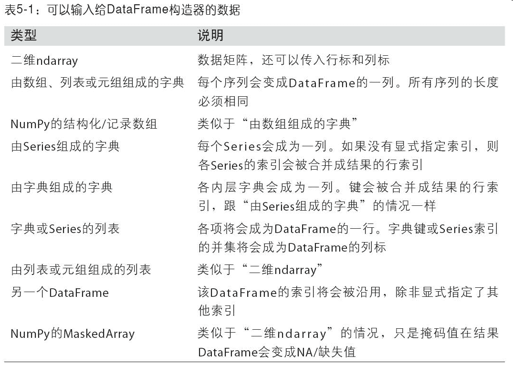
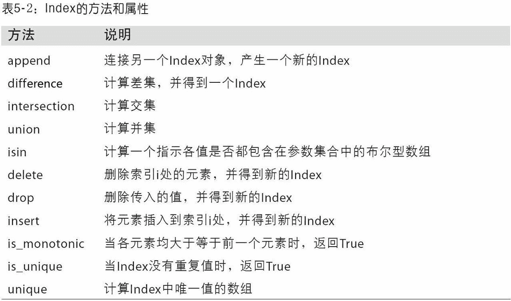
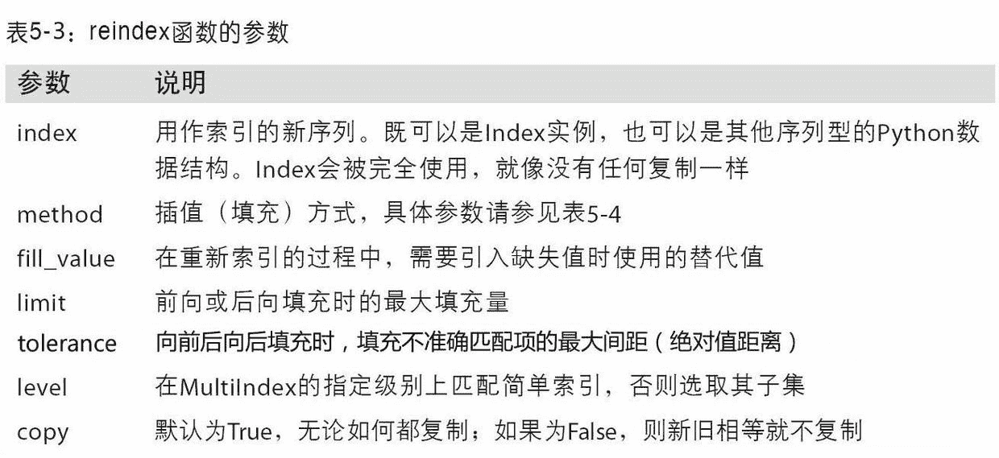
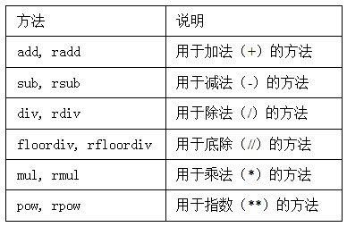
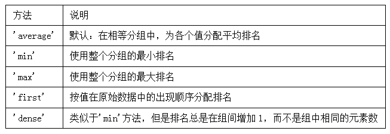
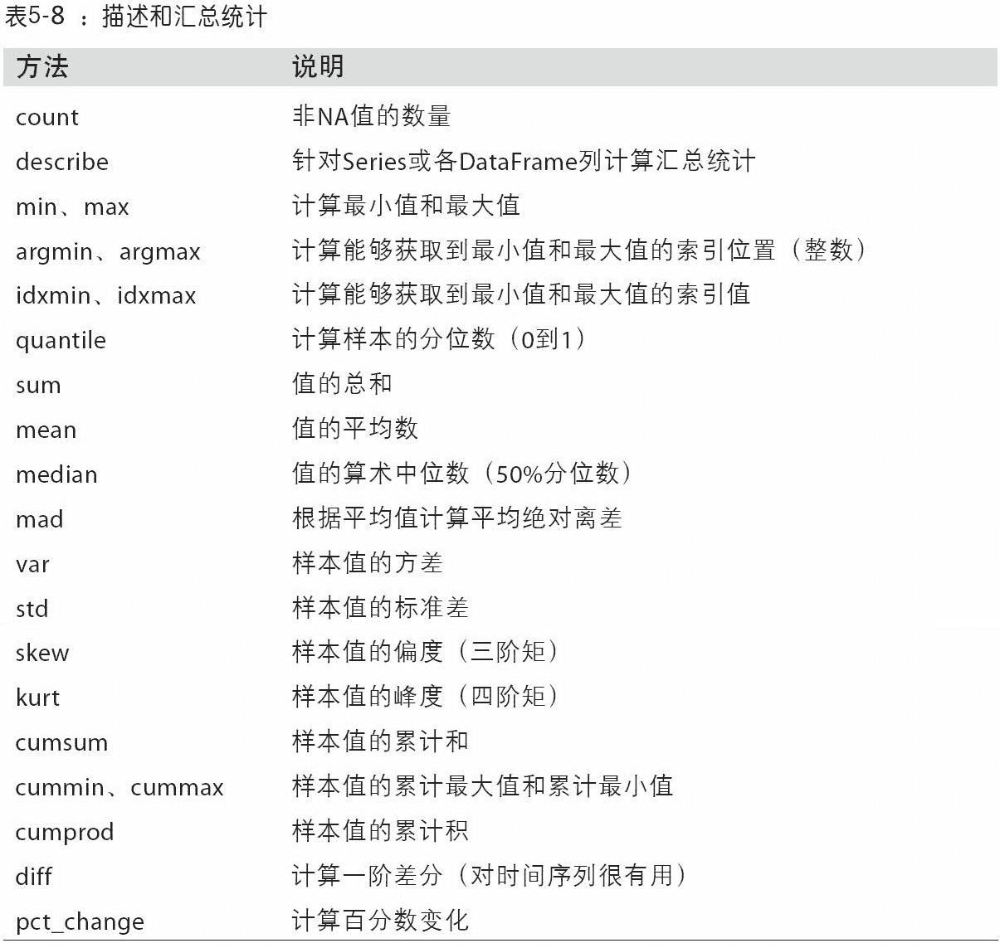

# 第 5 章 pandas 入门

pandas 是本书后续内容的首选库。它含有使数据清洗和分析工作变得更快更简单的数据结构和操作工具。pandas 经常和其它工具一同使用，如数值计算工具 NumPy 和 SciPy，分析库 statsmodels 和 scikit-learn，和数据可视化库 matplotlib。pandas 是基于 NumPy 数组构建的，特别是基于数组的函数和不使用`for`循环的数据处理。

虽然 pandas 采用了大量的 NumPy 编码风格，但二者最大的不同是 pandas 是专门为处理表格和混杂数据设计的。而 NumPy 更适合处理统一的数值数组数据。

自从 2010 年 pandas 开源以来，pandas 逐渐成长为一个非常大的库，应用于许多真实案例。开发者社区已经有了 800 个独立的贡献者，他们在解决日常数据问题的同时为这个项目提供贡献。

在本书后续部分中，我将使用下面这样的 pandas 引入约定：

```python
In [1]: import pandas as pd
```

因此，只要你在代码中看到 pd.，就得想到这是 pandas。因为`Series`和`DataFrame`用的次数非常多，所以将其引入本地命名空间中会更方便：

```python
In [2]: from pandas import Series, DataFrame
```

# 5.1 pandas 的数据结构介绍
要使用 pandas，你首先就得熟悉它的两个主要数据结构：`Series`和`DataFrame`。虽然它们并不能解决所有问题，但它们为大多数应用提供了一种可靠的、易于使用的基础。

## Series
`Series`是一种类似于一维数组的对象，它由一组数据（各种 NumPy 数据类型）以及一组与之相关的数据标签（即索引）组成。仅由一组数据即可产生最简单的`Series`：

```python
In [11]: obj = pd.Series([4, 7, -5, 3])

In [12]: obj
Out[12]: 
0    4
1    7
2   -5
3    3
dtype: int64
```

`Series`的字符串表现形式为：索引在左边，值在右边。由于我们没有为数据指定索引，于是会自动创建一个 0 到`N-1`（`N`为数据的长度）的整数型索引。你可以通过`Series`的`values`和`index`属性获取其数组表示形式和索引对象：

```python
In [13]: obj.values
Out[13]: array([ 4,  7, -5,  3])

In [14]: obj.index  # like range(4)
Out[14]: RangeIndex(start=0, stop=4, step=1)
```

通常，我们希望所创建的`Series`带有一个可以对各个数据点进行标记的索引：

```python
In [15]: obj2 = pd.Series([4, 7, -5, 3], index=['d', 'b', 'a', 'c'])

In [16]: obj2
Out[16]: 
d    4
b    7
a   -5
c    3
dtype: int64

In [17]: obj2.index
Out[17]: Index(['d', 'b', 'a', 'c'], dtype='object')
```

与普通 NumPy 数组相比，你可以通过索引的方式选取`Series`中的单个或一组值：

```python
In [18]: obj2['a']
Out[18]: -5

In [19]: obj2['d'] = 6

In [20]: obj2[['c', 'a', 'd']]
Out[20]: 
c    3
a   -5
d    6
dtype: int64
```

`['c', 'a', 'd']`是索引列表，即使它包含的是字符串而不是整数。

使用 NumPy 函数或类似 NumPy 的运算（如根据布尔型数组进行过滤、标量乘法、应用数学函数等）都会保留索引值的链接：

```python
In [21]: obj2[obj2 > 0]
Out[21]: 
d    6
b    7
c    3
dtype: int64

In [22]: obj2 * 2
Out[22]:
d    12
b    14
a   -10
c     6
dtype: int64

In [23]: np.exp(obj2)
Out[23]: 
d     403.428793
b    1096.633158
a       0.006738
c      20.085537
dtype: float64
```

还可以将`Series`看成是一个定长的有序字典，因为它是索引值到数据值的一个映射。它可以用在许多原本需要字典参数的函数中：

```python
In [24]: 'b' in obj2
Out[24]: True

In [25]: 'e' in obj2
Out[25]: False
```

如果数据被存放在一个 Python 字典中，也可以直接通过这个字典来创建`Series`：

```python
In [26]: sdata = {'Ohio': 35000, 'Texas': 71000, 'Oregon': 16000, 'Utah': 5000}

In [27]: obj3 = pd.Series(sdata)

In [28]: obj3
Out[28]: 
Ohio      35000
Oregon    16000
Texas     71000
Utah       5000
dtype: int64
```

如果只传入一个字典，则结果`Series`中的索引就是原字典的键（有序排列）。你可以传入排好序的字典的键以改变顺序：

```python
In [29]: states = ['California', 'Ohio', 'Oregon', 'Texas']

In [30]: obj4 = pd.Series(sdata, index=states)

In [31]: obj4
Out[31]: 
California        NaN
Ohio          35000.0
Oregon        16000.0
Texas         71000.0
dtype: float64
```

在这个例子中，`sdata`中跟`states`索引相匹配的那 3 个值会被找出来并放到相应的位置上，但由于`"California"`所对应的`sdata`值找不到，所以其结果就为`NaN`（即“非数字”（not a number），在 pandas 中，它用于表示缺失或 NA 值）。因为`Utah`不在`states`中，它被从结果中除去。

我将使用缺失（missing）或 NA 表示缺失数据。pandas 的`isnull`和`notnull`函数可用于检测缺失数据：

```python
In [32]: pd.isnull(obj4)
Out[32]: 
California     True
Ohio          False
Oregon        False
Texas         False
dtype: bool

In [33]: pd.notnull(obj4)
Out[33]: 
California    False
Ohio           True
Oregon         True
Texas          True
dtype: bool
```

`Series`也有类似的实例方法：

```python
In [34]: obj4.isnull()
Out[34]: 
California     True
Ohio          False
Oregon        False
Texas         False
dtype: bool
```

我将在第 7 章详细讲解如何处理缺失数据。

对于许多应用而言，`Series`最重要的一个功能是，它会根据运算的索引标签自动对齐数据：

```python
In [35]: obj3
Out[35]: 
Ohio      35000
Oregon    16000
Texas     71000
Utah       5000
dtype: int64

In [36]: obj4
Out[36]: 
California        NaN
Ohio          35000.0
Oregon        16000.0
Texas         71000.0
dtype: float64

In [37]: obj3 + obj4
Out[37]: 
California         NaN
Ohio           70000.0
Oregon         32000.0
Texas         142000.0
Utah               NaN
dtype: float64
```

数据对齐功能将在后面详细讲解。如果你使用过数据库，你可以认为是类似`join`的操作。

`Series`对象本身及其索引都有一个`name`属性，该属性跟 pandas 其他的关键功能关系非常密切：

```python
In [38]: obj4.name = 'population'

In [39]: obj4.index.name = 'state'

In [40]: obj4
Out[40]: 
state
California        NaN
Ohio          35000.0
Oregon        16000.0
Texas         71000.0
Name: population, dtype: float64
```

`Series`的索引可以通过赋值的方式就地修改：

```python
In [41]: obj
Out[41]: 
0    4
1    7
2   -5
3    3
dtype: int64

In [42]: obj.index = ['Bob', 'Steve', 'Jeff', 'Ryan']

In [43]: obj
Out[43]: 
Bob      4
Steve    7
Jeff    -5
Ryan     3
dtype: int64
```

## DataFrame
`DataFrame`是一个表格型的数据结构，它含有一组有序的列，每列可以是不同的值类型（数值、字符串、布尔值等）。`DataFrame`既有行索引也有列索引，它可以被看做由`Series`组成的字典（共用同一个索引）。`DataFrame`中的数据是以一个或多个二维块存放的（而不是列表、字典或别的一维数据结构）。有关`DataFrame`内部的技术细节远远超出了本书所讨论的范围。

> 笔记：虽然`DataFrame`是以二维结构保存数据的，但你仍然可以轻松地将其表示为更高维度的数据（层次化索引的表格型结构，这是 pandas 中许多高级数据处理功能的关键要素，我们会在第 8 章讨论这个问题）。

建`DataFrame`的办法有很多，最常用的一种是直接传入一个由等长列表或 NumPy 数组组成的字典：

```python
data = {'state': ['Ohio', 'Ohio', 'Ohio', 'Nevada', 'Nevada', 'Nevada'],
        'year': [2000, 2001, 2002, 2001, 2002, 2003],
        'pop': [1.5, 1.7, 3.6, 2.4, 2.9, 3.2]}
frame = pd.DataFrame(data)
```

结果`DataFrame`会自动加上索引（跟`Series`一样），且全部列会被有序排列：

```python
In [45]: frame
Out[45]: 
   pop   state  year
0  1.5    Ohio  2000
1  1.7    Ohio  2001
2  3.6    Ohio  2002
3  2.4  Nevada  2001
4  2.9  Nevada  2002
5  3.2  Nevada  2003
```

如果你使用的是 Jupyter 笔记本，pandas `DataFrame`对象会以对浏览器友好的 HTML 表格的方式呈现。

对于特别大的`DataFrame`，`head`方法会选取前五行：

```python
In [46]: frame.head()
Out[46]: 
   pop   state  year
0  1.5    Ohio  2000
1  1.7    Ohio  2001
2  3.6    Ohio  2002
3  2.4  Nevada  2001
4  2.9  Nevada  2002
```

如果指定了列序列，则`DataFrame`的列就会按照指定顺序进行排列：

```python
In [47]: pd.DataFrame(data, columns=['year', 'state', 'pop'])
Out[47]: 
   year   state  pop
0  2000    Ohio  1.5
1  2001    Ohio  1.7
2  2002    Ohio  3.6
3  2001  Nevada  2.4
4  2002  Nevada  2.9
5  2003  Nevada  3.2
```

如果传入的列在数据中找不到，就会在结果中产生缺失值：

```python
In [48]: frame2 = pd.DataFrame(data, columns=['year', 'state', 'pop', 'debt'],
   ....:                       index=['one', 'two', 'three', 'four',
   ....:                              'five', 'six'])

In [49]: frame2
Out[49]: 
       year   state  pop debt
one    2000    Ohio  1.5  NaN
two    2001    Ohio  1.7  NaN
three  2002    Ohio  3.6  NaN
four   2001  Nevada  2.4  NaN
five   2002  Nevada  2.9  NaN
six    2003  Nevada  3.2  NaN

In [50]: frame2.columns
Out[50]: Index(['year', 'state', 'pop', 'debt'], dtype='object')
```

通过类似字典标记的方式或属性的方式，可以将`DataFrame`的列获取为一个`Series`：

```python
In [51]: frame2['state']
Out[51]: 
one        Ohio
two        Ohio
three      Ohio
four     Nevada
five     Nevada
six      Nevada
Name: state, dtype: object

In [52]: frame2.year
Out[52]: 
one      2000
two      2001
three    2002
four     2001
five     2002
six      2003
Name: year, dtype: int64
```

> 笔记：IPython 提供了类似属性的访问（即`frame2.year`）和`Tab`补全。
`frame2[column]`适用于任何列的名，但是`frame2.column`只有在列名是一个合理的 Python 变量名时才适用。

注意，返回的`Series`拥有原`DataFrame`相同的索引，且其`name`属性也已经被相应地设置好了。

行也可以通过位置或名称的方式进行获取，比如用`loc`属性（稍后将对此进行详细讲解）：

```python
In [53]: frame2.loc['three']
Out[53]: 
year     2002
state    Ohio
pop       3.6
debt      NaN
Name: three, dtype: object
```

列可以通过赋值的方式进行修改。例如，我们可以给那个空的"debt"列赋上一个标量值或一组值：

```python
In [54]: frame2['debt'] = 16.5

In [55]: frame2
Out[55]: 
       year   state  pop  debt
one    2000    Ohio  1.5  16.5
two    2001    Ohio  1.7  16.5
three  2002    Ohio  3.6  16.5
four   2001  Nevada  2.4  16.5
five   2002  Nevada  2.9  16.5
six    2003  Nevada  3.2  16.5

In [56]: frame2['debt'] = np.arange(6.)

In [57]: frame2
Out[57]: 
       year   state  pop  debt
one    2000    Ohio  1.5   0.0
two    2001    Ohio  1.7   1.0
three  2002    Ohio  3.6   2.0
four   2001  Nevada  2.4   3.0
five   2002  Nevada  2.9   4.0
six    2003  Nevada  3.2   5.0
```

将列表或数组赋值给某个列时，其长度必须跟`DataFrame`的长度相匹配。如果赋值的是一个`Series`，就会精确匹配`DataFrame`的索引，所有的空位都将被填上缺失值：

```python
In [58]: val = pd.Series([-1.2, -1.5, -1.7], index=['two', 'four', 'five'])

In [59]: frame2['debt'] = val

In [60]: frame2
Out[60]: 
       year   state  pop  debt
one    2000    Ohio  1.5   NaN
two    2001    Ohio  1.7  -1.2
three  2002    Ohio  3.6   NaN
four   2001  Nevada  2.4  -1.5
five   2002  Nevada  2.9  -1.7
six    2003  Nevada  3.2   NaN
```

为不存在的列赋值会创建出一个新列。关键字`del`用于删除列。

作为`del`的例子，我先添加一个新的布尔值的列，`state`是否为`'Ohio'`：

```python
In [61]: frame2['eastern'] = frame2.state == 'Ohio'

In [62]: frame2
Out[62]: 
       year   state  pop  debt  eastern
one    2000    Ohio  1.5   NaN     True
two    2001    Ohio  1.7  -1.2     True
three  2002    Ohio  3.6   NaN     True
four   2001  Nevada  2.4  -1.5    False
five   2002  Nevada  2.9  -1.7    False
six    2003  Nevada  3.2   NaN    False
```

> 注意：不能用`frame2.eastern`创建新的列。

`del`方法可以用来删除这列：

```python
In [63]: del frame2['eastern']

In [64]: frame2.columns
Out[64]: Index(['year', 'state', 'pop', 'debt'], dtype='object')
```

> 注意：通过索引方式返回的列只是相应数据的视图而已，并不是副本。因此，对返回的`Series`所做的任何就地修改全都会反映到源`DataFrame`上。通过`Series`的`copy`方法即可指定复制列。

另一种常见的数据形式是嵌套字典：

```python
In [65]: pop = {'Nevada': {2001: 2.4, 2002: 2.9},
....:        'Ohio': {2000: 1.5, 2001: 1.7, 2002: 3.6}}
```

如果嵌套字典传给`DataFrame`，pandas 就会被解释为：外层字典的键作为列，内层键则作为行索引：

```python
In [66]: frame3 = pd.DataFrame(pop)

In [67]: frame3
Out[67]: 
      Nevada  Ohio
2000     NaN   1.5
2001     2.4   1.7
2002     2.9   3.6
```

你也可以使用类似 NumPy 数组的方法，对`DataFrame`进行转置（交换行和列）：

```python
In [68]: frame3.T
Out[68]: 
        2000  2001  2002
Nevada   NaN   2.4   2.9
Ohio     1.5   1.7   3.6
```

内层字典的键会被合并、排序以形成最终的索引。如果明确指定了索引，则不会这样：

```python
In [69]: pd.DataFrame(pop, index=[2001, 2002, 2003])
Out[69]: 
      Nevada  Ohio
2001     2.4   1.7
2002     2.9   3.6
2003     NaN   NaN
```

由`Series`组成的字典差不多也是一样的用法：

```python
In [70]: pdata = {'Ohio': frame3['Ohio'][:-1],
....:          'Nevada': frame3['Nevada'][:2]}

In [71]: pd.DataFrame(pdata)
Out[71]: 
      Nevada  Ohio
2000     NaN   1.5
2001     2.4   1.7
```

表 5-1 列出了`DataFrame`构造函数所能接受的各种数据。



如果设置了`DataFrame`的`index`和`columns`的`name`属性，则这些信息也会被显示出来：

```python
In [72]: frame3.index.name = 'year'; frame3.columns.name = 'state'

In [73]: frame3
Out[73]: 
state  Nevada  Ohio
year
2000      NaN   1.5
2001      2.4   1.7
2002      2.9   3.6
```

跟`Series`一样，`values`属性也会以二维`ndarray`的形式返回`DataFrame`中的数据：

```python
In [74]: frame3.values
Out[74]: 
array([[ nan,  1.5],
       [ 2.4,  1.7],
       [ 2.9,  3.6]])
```

如果`DataFrame`各列的数据类型不同，则值数组的`dtype`就会选用能兼容所有列的数据类型：

```python
In [75]: frame2.values
Out[75]:
array([[2000, 'Ohio', 1.5, nan],
       [2001, 'Ohio', 1.7, -1.2],
       [2002, 'Ohio', 3.6, nan],
       [2001, 'Nevada', 2.4, -1.5],
       [2002, 'Nevada', 2.9, -1.7],
       [2003, 'Nevada', 3.2, nan]], dtype=object)
```

## 索引对象
pandas 的索引对象负责管理轴标签和其他元数据（比如轴名称等）。构建`Series`或`DataFrame`时，所用到的任何数组或其他序列的标签都会被转换成一个`Index`：

```python
In [76]: obj = pd.Series(range(3), index=['a', 'b', 'c'])

In [77]: index = obj.index

In [78]: index
Out[78]: Index(['a', 'b', 'c'], dtype='object')

In [79]: index[1:]
Out[79]: Index(['b', 'c'], dtype='object')
```

`Index`对象是不可变的，因此用户不能对其进行修改：

```python
index[1] = 'd'  # TypeError
```

不可变可以使`Index`对象在多个数据结构之间安全共享：

```python
In [80]: labels = pd.Index(np.arange(3))

In [81]: labels
Out[81]: Int64Index([0, 1, 2], dtype='int64')

In [82]: obj2 = pd.Series([1.5, -2.5, 0], index=labels)

In [83]: obj2
Out[83]: 
0    1.5
1   -2.5
2    0.0
dtype: float64

In [84]: obj2.index is labels
Out[84]: True
```

> 注意：虽然用户不需要经常使用`Index`的功能，但是因为一些操作会生成包含被索引化的数据，理解它们的工作原理是很重要的。

除了类似于数组，`Index`的功能也类似一个固定大小的集合：

```python
In [85]: frame3
Out[85]: 
state  Nevada  Ohio
year               
2000      NaN   1.5
2001      2.4   1.7
2002      2.9   3.6
In [86]: frame3.columns
Out[86]: Index(['Nevada', 'Ohio'], dtype='object', name='state')

In [87]: 'Ohio' in frame3.columns
Out[87]: True

In [88]: 2003 in frame3.index
Out[88]: False
```

与 python 的集合不同，pandas 的`Index`可以包含重复的标签：

```python
In [89]: dup_labels = pd.Index(['foo', 'foo', 'bar', 'bar'])

In [90]: dup_labels
Out[90]: Index(['foo', 'foo', 'bar', 'bar'], dtype='object')
```

选择重复的标签，会显示所有的结果。

每个索引都有一些方法和属性，它们可用于设置逻辑并回答有关该索引所包含的数据的常见问题。表 5-2 列出了这些函数。



# 5.2 基本功能
本节中，我将介绍操作`Series`和`DataFrame`中的数据的基本手段。后续章节将更加深入地挖掘 pandas 在数据分析和处理方面的功能。本书不是 pandas 库的详尽文档，主要关注的是最重要的功能，那些不大常用的内容（也就是那些更深奥的内容）就交给你自己去摸索吧。

## 重新索引
pandas 对象的一个重要方法是`reindex`，其作用是创建一个新对象，它的数据符合新的索引。看下面的例子：

```python
In [91]: obj = pd.Series([4.5, 7.2, -5.3, 3.6], index=['d', 'b', 'a', 'c'])

In [92]: obj
Out[92]: 
d    4.5
b    7.2
a   -5.3
c    3.6
dtype: float64
```

用该`Series`的`reindex`将会根据新索引进行重排。如果某个索引值当前不存在，就引入缺失值：

```python
In [93]: obj2 = obj.reindex(['a', 'b', 'c', 'd', 'e'])

In [94]: obj2
Out[94]: 
a   -5.3
b    7.2
c    3.6
d    4.5
e    NaN
dtype: float64
```

对于时间序列这样的有序数据，重新索引时可能需要做一些插值处理。`method`选项即可达到此目的，例如，使用`ffill`可以实现前向值填充：

```python
In [95]: obj3 = pd.Series(['blue', 'purple', 'yellow'], index=[0, 2, 4])

In [96]: obj3
Out[96]: 
0      blue
2    purple
4    yellow
dtype: object

In [97]: obj3.reindex(range(6), method='ffill')
Out[97]: 
0      blue
1      blue
2    purple
3    purple
4    yellow
5    yellow
dtype: object
```

借助`DataFrame`，`reindex`可以修改（行）索引和列。只传递一个序列时，会重新索引结果的行：

```python
In [98]: frame = pd.DataFrame(np.arange(9).reshape((3, 3)),
   ....:                      index=['a', 'c', 'd'],
   ....:                      columns=['Ohio', 'Texas', 'California'])

In [99]: frame
Out[99]: 
   Ohio  Texas  California
a     0      1           2
c     3      4           5
d     6      7           8

In [100]: frame2 = frame.reindex(['a', 'b', 'c', 'd'])

In [101]: frame2
Out[101]: 
   Ohio  Texas  California
a   0.0    1.0         2.0
b   NaN    NaN         NaN
c   3.0    4.0         5.0
d   6.0    7.0         8.0
```

列可以用`columns`关键字重新索引：

```python
In [102]: states = ['Texas', 'Utah', 'California']

In [103]: frame.reindex(columns=states)
Out[103]: 
   Texas  Utah  California
a      1   NaN           2
c      4   NaN           5
d      7   NaN           8
```

表 5-3 列出了`reindex`函数的各参数及说明。



## 丢弃指定轴上的项
丢弃某条轴上的一个或多个项很简单，只要有一个索引数组或列表即可。由于需要执行一些数据整理和集合逻辑，所以`drop`方法返回的是一个在指定轴上删除了指定值的新对象：

```python
In [105]: obj = pd.Series(np.arange(5.), index=['a', 'b', 'c', 'd', 'e'])

In [106]: obj
Out[106]: 
a    0.0
b    1.0
c    2.0
d    3.0
e    4.0
dtype: float64

In [107]: new_obj = obj.drop('c')

In [108]: new_obj
Out[108]: 
a    0.0
b    1.0
d    3.0
e    4.0
dtype: float64

In [109]: obj.drop(['d', 'c'])
Out[109]: 
a    0.0
b    1.0
e    4.0
dtype: float64
```

对于`DataFrame`，可以删除任意轴上的索引值。为了演示，先新建一个`DataFrame`例子：

```python
In [110]: data = pd.DataFrame(np.arange(16).reshape((4, 4)),
   .....:                     index=['Ohio', 'Colorado', 'Utah', 'New York'],
   .....:                     columns=['one', 'two', 'three', 'four'])

In [111]: data
Out[111]: 
          one  two  three  four
Ohio        0    1      2     3
Colorado    4    5      6     7
Utah        8    9     10    11
New York   12   13     14    15
```

用标签序列调用`drop`会从行标签（轴 0）删除值：

```python
In [112]: data.drop(['Colorado', 'Ohio'])
Out[112]: 
          one  two  three  four
Utah        8    9     10    11
New York   12   13     14    15
```

通过传递`axis=1`或`axis='columns'`可以删除列的值：

```python
In [113]: data.drop('two', axis=1)
Out[113]: 
          one  three  four
Ohio        0      2     3
Colorado    4      6     7
Utah        8     10    11
New York   12     14    15

In [114]: data.drop(['two', 'four'], axis='columns')
Out[114]: 
          one  three
Ohio        0      2
Colorado    4      6
Utah        8     10
New York   12     14
```

许多函数，如`drop`，会修改`Series`或`DataFrame`的大小或形状，可以就地修改对象，不会返回新的对象：

```python
In [115]: obj.drop('c', inplace=True)

In [116]: obj
Out[116]: 
a    0.0
b    1.0
d    3.0
e    4.0
dtype: float64
```

小心使用`inplace`，它会销毁所有被删除的数据。

## 索引、选取和过滤
`Series`索引（`obj[...]`）的工作方式类似于 NumPy 数组的索引，只不过`Series`的索引值不只是整数。下面是几个例子：

```python
In [117]: obj = pd.Series(np.arange(4.), index=['a', 'b', 'c', 'd'])

In [118]: obj
Out[118]: 
a    0.0
b    1.0
c    2.0
d    3.0
dtype: float64

In [119]: obj['b']
Out[119]: 1.0

In [120]: obj[1]
Out[120]: 1.0

In [121]: obj[2:4]
Out[121]: 
c    2.0
d    3.0
dtype: float64

In [122]: obj[['b', 'a', 'd']]
Out[122]:
b    1.0
a    0.0
d    3.0
dtype: float64

In [123]: obj[[1, 3]]
Out[123]: 
b    1.0
d    3.0
dtype: float64

In [124]: obj[obj < 2]
Out[124]: 
a    0.0
b    1.0
dtype: float64
```

利用标签的切片运算与普通的 Python 切片运算不同，其末端是包含的：

```python
In [125]: obj['b':'c']
Out[125]:
b    1.0
c    2.0
dtype: float64
```

用切片可以对`Series`的相应部分进行设置：

```python
In [126]: obj['b':'c'] = 5

In [127]: obj
Out[127]: 
a    0.0
b    5.0
c    5.0
d    3.0
dtype: float64
```

用一个值或序列对`DataFrame`进行索引其实就是获取一个或多个列：

```python
In [128]: data = pd.DataFrame(np.arange(16).reshape((4, 4)),
   .....:                     index=['Ohio', 'Colorado', 'Utah', 'New York'],
   .....:                     columns=['one', 'two', 'three', 'four'])

In [129]: data
Out[129]: 
          one  two  three  four
Ohio        0    1      2     3
Colorado    4    5      6     7
Utah        8    9     10    11
New York   12   13     14    15

In [130]: data['two']
Out[130]: 
Ohio         1
Colorado     5
Utah         9
New York    13
Name: two, dtype: int64

In [131]: data[['three', 'one']]
Out[131]: 
          three  one
Ohio          2    0
Colorado      6    4
Utah         10    8
New York     14   12
```

这种索引方式有几个特殊的情况。首先通过切片或布尔型数组选取数据：

```python
In [132]: data[:2]
Out[132]: 
          one  two  three  four
Ohio        0    1      2     3
Colorado    4    5      6     7

In [133]: data[data['three'] > 5]
Out[133]: 
          one  two  three  four
Colorado    4    5      6     7
Utah        8    9     10    11
New York   12   13     14    15
```

选取行的语法`data[:2]`十分方便。向`[ ]`传递单一的元素或列表，就可选择列。

另一种用法是通过布尔型`DataFrame`（比如下面这个由标量比较运算得出的）进行索引：

```python
In [134]: data < 5
Out[134]: 
            one    two  three   four
Ohio       True   True   True   True
Colorado   True  False  False  False
Utah      False  False  False  False
New York  False  False  False  False

In [135]: data[data < 5] = 0

In [136]: data
Out[136]: 
          one  two  three  four
Ohio        0    0      0     0
Colorado    0    5      6     7
Utah        8    9     10    11
New York   12   13     14    15
```

这使得`DataFrame`的语法与 NumPy 二维数组的语法很像。

## 用`loc`和`iloc`进行选取
对于`DataFrame`的行的标签索引，我引入了特殊的标签运算符`loc`和`iloc`。它们可以让你用类似 NumPy 的标记，使用轴标签（`loc`）或整数索引（`iloc`），从`DataFrame`选择行和列的子集。

作为一个初步示例，让我们通过标签选择一行和多列：

```python
In [137]: data.loc['Colorado', ['two', 'three']]
Out[137]: 
two      5
three    6
Name: Colorado, dtype: int64
```

然后用`iloc`和整数进行选取：

```python
In [138]: data.iloc[2, [3, 0, 1]]
Out[138]: 
four    11
one      8
two      9
Name: Utah, dtype: int64

In [139]: data.iloc[2]
Out[139]: 
one       8
two       9
three    10
four     11
Name: Utah, dtype: int64

In [140]: data.iloc[[1, 2], [3, 0, 1]]
Out[140]: 
          four  one  two
Colorado     7    0    5
Utah        11    8    9
```

这两个索引函数也适用于一个标签或多个标签的切片：

```python
In [141]: data.loc[:'Utah', 'two']
Out[141]: 
Ohio        0
Colorado    5
Utah        9
Name: two, dtype: int64

In [142]: data.iloc[:, :3][data.three > 5]
Out[142]: 
          one  two  three
Colorado    0    5      6
Utah        8    9     10
New York   12   13     14
```

所以，在 pandas 中，有多个方法可以选取和重新组合数据。对于`DataFrame`，表 5-4 进行了总结。后面会看到，还有更多的方法进行层级化索引。

> 笔记：在一开始设计 pandas 时，我觉得用`frame[:, col]`选取列过于繁琐（也容易出错），因为列的选择是非常常见的操作。我做了些取舍，将花式索引的功能（标签和整数）放到了`ix`运算符中。在实践中，这会导致许多边缘情况，数据的轴标签是整数，所以 pandas 团队决定创造`loc`和`iloc`运算符分别处理严格基于标签和整数的索引。
`ix`运算符仍然可用，但并不推荐。


## 整数索引
处理整数索引的 pandas 对象常常难住新手，因为它与 Python 内置的列表和元组的索引语法不同。例如，你可能不认为下面的代码会出错：

```python
ser = pd.Series(np.arange(3.))
ser
ser[-1]
```

这里，pandas 可以勉强进行整数索引，但是会导致小 bug。我们有包含`0,1,2`的索引，但是引入用户想要的东西（基于标签或位置的索引）很难：

```python
In [144]: ser
Out[144]: 
0    0.0
1    1.0
2    2.0
dtype: float64
```

另外，对于非整数索引，不会产生歧义：

```python
In [145]: ser2 = pd.Series(np.arange(3.), index=['a', 'b', 'c'])

In [146]: ser2[-1]
Out[146]: 2.0
```

为了进行统一，如果轴索引含有整数，数据选取总会使用标签。为了更准确，请使用`loc`（标签）或`iloc`（整数）：

```python
In [147]: ser[:1]
Out[147]: 
0    0.0
dtype: float64

In [148]: ser.loc[:1]
Out[148]: 
0    0.0
1    1.0
dtype: float64

In [149]: ser.iloc[:1]
Out[149]: 
0    0.0
dtype: float64
```

## 算术运算和数据对齐
pandas 最重要的一个功能是，它可以对不同索引的对象进行算术运算。在将对象相加时，如果存在不同的索引对，则结果的索引就是该索引对的并集。对于有数据库经验的用户，这就像在索引标签上进行自动外连接。看一个简单的例子：

```python
In [150]: s1 = pd.Series([7.3, -2.5, 3.4, 1.5], index=['a', 'c', 'd', 'e'])

In [151]: s2 = pd.Series([-2.1, 3.6, -1.5, 4, 3.1],
   .....:                index=['a', 'c', 'e', 'f', 'g'])

In [152]: s1
Out[152]: 
a    7.3
c   -2.5
d    3.4
e    1.5
dtype: float64

In [153]: s2
Out[153]: 
a   -2.1
c    3.6
e   -1.5
f    4.0
g    3.1
dtype: float64
```

将它们相加就会产生：

```python
In [154]: s1 + s2
Out[154]: 
a    5.2
c    1.1
d    NaN
e    0.0
f    NaN
g    NaN
dtype: float64
```

自动的数据对齐操作在不重叠的索引处引入了 NA 值。缺失值会在算术运算过程中传播。

对于`DataFrame`，对齐操作会同时发生在行和列上：

```python
In [155]: df1 = pd.DataFrame(np.arange(9.).reshape((3, 3)), columns=list('bcd'),
   .....:                    index=['Ohio', 'Texas', 'Colorado'])

In [156]: df2 = pd.DataFrame(np.arange(12.).reshape((4, 3)), columns=list('bde'),
   .....:                    index=['Utah', 'Ohio', 'Texas', 'Oregon'])

In [157]: df1
Out[157]: 
            b    c    d
Ohio      0.0  1.0  2.0
Texas     3.0  4.0  5.0
Colorado  6.0  7.0  8.0

In [158]: df2
Out[158]: 
          b     d     e
Utah    0.0   1.0   2.0
Ohio    3.0   4.0   5.0
Texas   6.0   7.0   8.0
Oregon  9.0  10.0  11.0
```

把它们相加后将会返回一个新的`DataFrame`，其索引和列为原来那两个`DataFrame`的并集：

```python
In [159]: df1 + df2
Out[159]: 
            b   c     d   e
Colorado  NaN NaN   NaN NaN
Ohio      3.0 NaN   6.0 NaN
Oregon    NaN NaN   NaN NaN
Texas     9.0 NaN  12.0 NaN
Utah      NaN NaN   NaN NaN
```

因为'c'和'e'列均不在两个`DataFrame`对象中，在结果中以缺省值呈现。行也是同样。

如果`DataFrame`对象相加，没有共用的列或行标签，结果都会是空：

```python
In [160]: df1 = pd.DataFrame({'A': [1, 2]})

In [161]: df2 = pd.DataFrame({'B': [3, 4]})

In [162]: df1
Out[162]: 
   A
0  1
1  2

In [163]: df2
Out[163]: 
   B
0  3
1  4

In [164]: df1 - df2
Out[164]: 
    A   B
0 NaN NaN
1 NaN NaN
```

## 在算术方法中填充值
在对不同索引的对象进行算术运算时，你可能希望当一个对象中某个轴标签在另一个对象中找不到时填充一个特殊值（比如 0）：

```python
In [165]: df1 = pd.DataFrame(np.arange(12.).reshape((3, 4)),
   .....:                    columns=list('abcd'))

In [166]: df2 = pd.DataFrame(np.arange(20.).reshape((4, 5)),
   .....:                    columns=list('abcde'))

In [167]: df2.loc[1, 'b'] = np.nan

In [168]: df1
Out[168]: 
     a    b     c     d
0  0.0  1.0   2.0   3.0
1  4.0  5.0   6.0   7.0
2  8.0  9.0  10.0  11.0

In [169]: df2
Out[169]: 
      a     b     c     d     e
0   0.0   1.0   2.0   3.0   4.0
1   5.0   NaN   7.0   8.0   9.0
2  10.0  11.0  12.0  13.0  14.0
3  15.0  16.0  17.0  18.0  19.0
```

将它们相加时，没有重叠的位置就会产生 NA 值：

```python
In [170]: df1 + df2
Out[170]: 
      a     b     c     d   e
0   0.0   2.0   4.0   6.0 NaN
1   9.0   NaN  13.0  15.0 NaN
2  18.0  20.0  22.0  24.0 NaN
3   NaN   NaN   NaN   NaN NaN
```

使用`df1`的`add`方法，传入`df2`以及一个`fill_value`参数：

```python
In [171]: df1.add(df2, fill_value=0)
Out[171]: 
      a     b     c     d     e
0   0.0   2.0   4.0   6.0   4.0
1   9.0   5.0  13.0  15.0   9.0
2  18.0  20.0  22.0  24.0  14.0
3  15.0  16.0  17.0  18.0  19.0
```

表 5-5 列出了`Series`和`DataFrame`的算术方法。它们每个都有一个副本，以字母`r`开头，它会翻转参数。因此这两个语句是等价的：

```python
In [172]: 1 / df1
Out[172]: 
          a         b         c         d
0       inf  1.000000  0.500000  0.333333
1  0.250000  0.200000  0.166667  0.142857
2  0.125000  0.111111  0.100000  0.090909

In [173]: df1.rdiv(1)
Out[173]: 
          a         b         c         d
0       inf  1.000000  0.500000  0.333333
1  0.250000  0.200000  0.166667  0.142857
2  0.125000  0.111111  0.100000  0.090909
```



与此类似，在对`Series`或`DataFrame`重新索引时，也可以指定一个填充值：

```python
In [174]: df1.reindex(columns=df2.columns, fill_value=0)
Out[174]: 
     a    b     c     d  e
0  0.0  1.0   2.0   3.0  0
1  4.0  5.0   6.0   7.0  0
2  8.0  9.0  10.0  11.0  0
```

## `DataFrame`和`Series`之间的运算
跟不同维度的 NumPy 数组一样，`DataFrame`和`Series`之间算术运算也是有明确规定的。先来看一个具有启发性的例子，计算一个二维数组与其某行之间的差：

```python
In [175]: arr = np.arange(12.).reshape((3, 4))

In [176]: arr
Out[176]: 
array([[  0.,   1.,   2.,   3.],
       [  4.,   5.,   6.,   7.],
       [  8.,   9.,  10.,  11.]])

In [177]: arr[0]
Out[177]: array([ 0.,  1.,  2.,  3.])

In [178]: arr - arr[0]
Out[178]: 
array([[ 0.,  0.,  0.,  0.],
       [ 4.,  4.,  4.,  4.],
       [ 8.,  8.,  8.,  8.]])
```

当我们从`arr`减去`arr[0]`，每一行都会执行这个操作。这就叫做广播（broadcasting），附录 A 将对此进行详细讲解。`DataFrame`和`Series`之间的运算差不多也是如此：

```python
In [179]: frame = pd.DataFrame(np.arange(12.).reshape((4, 3)),
   .....:                      columns=list('bde'),
   .....:                      index=['Utah', 'Ohio', 'Texas', 'Oregon'])

In [180]: series = frame.iloc[0]

In [181]: frame
Out[181]: 
          b     d     e
Utah    0.0   1.0   2.0
Ohio    3.0   4.0   5.0
Texas   6.0   7.0   8.0
Oregon  9.0  10.0  11.0

In [182]: series
Out[182]: 
b    0.0
d    1.0
e    2.0
Name: Utah, dtype: float64
```

默认情况下，`DataFrame`和`Series`之间的算术运算会将`Series`的索引匹配到`DataFrame`的列，然后沿着行一直向下广播：

```python
In [183]: frame - series
Out[183]: 
          b    d    e
Utah    0.0  0.0  0.0
Ohio    3.0  3.0  3.0
Texas   6.0  6.0  6.0
Oregon  9.0  9.0  9.0
```

如果某个索引值在`DataFrame`的列或`Series`的索引中找不到，则参与运算的两个对象就会被重新索引以形成并集：

```python
In [184]: series2 = pd.Series(range(3), index=['b', 'e', 'f'])

In [185]: frame + series2
Out[185]: 
          b   d     e   f
Utah    0.0 NaN   3.0 NaN
Ohio    3.0 NaN   6.0 NaN
Texas   6.0 NaN   9.0 NaN
Oregon  9.0 NaN  12.0 NaN
```

如果你希望匹配行且在列上广播，则必须使用算术运算方法。例如：

```python
In [186]: series3 = frame['d']

In [187]: frame
Out[187]: 
          b     d     e
Utah    0.0   1.0   2.0
Ohio    3.0   4.0   5.0
Texas   6.0   7.0   8.0
Oregon  9.0  10.0  11.0

In [188]: series3
Out[188]: 
Utah       1.0
Ohio       4.0
Texas      7.0
Oregon    10.0
Name: d, dtype: float64

In [189]: frame.sub(series3, axis='index')
Out[189]: 
          b    d    e
Utah   -1.0  0.0  1.0
Ohio   -1.0  0.0  1.0
Texas  -1.0  0.0  1.0
Oregon -1.0  0.0  1.0
```

传入的轴号就是希望匹配的轴。在本例中，我们的目的是匹配`DataFrame`的行索引（`axis='index'`或`axis=0`）并进行广播。

## 函数应用和映射
NumPy 的`ufuncs`（元素级数组方法）也可用于操作 pandas 对象：

```python
In [190]: frame = pd.DataFrame(np.random.randn(4, 3), columns=list('bde'),
   .....:                      index=['Utah', 'Ohio', 'Texas', 'Oregon'])

In [191]: frame
Out[191]: 
               b         d         e
Utah   -0.204708  0.478943 -0.519439
Ohio   -0.555730  1.965781  1.393406
Texas   0.092908  0.281746  0.769023
Oregon  1.246435  1.007189 -1.296221

In [192]: np.abs(frame)
Out[192]: 
               b         d         e
Utah    0.204708  0.478943  0.519439
Ohio    0.555730  1.965781  1.393406
Texas   0.092908  0.281746  0.769023
Oregon  1.246435  1.007189  1.296221
```

另一个常见的操作是，将函数应用到由各列或行所形成的一维数组上。`DataFrame`的`apply`方法即可实现此功能：

```python
In [193]: f = lambda x: x.max() - x.min()

In [194]: frame.apply(f)
Out[194]: 
b    1.802165
d    1.684034
e    2.689627
dtype: float64
```

这里的函数`f`，计算了一个`Series`的最大值和最小值的差，在`frame`的每列都执行了一次。结果是一个`Series`，使用`frame`的列作为索引。

如果传递`axis='columns'`到`apply`，这个函数会在每行执行：

```python
In [195]: frame.apply(f, axis='columns')
Out[195]:
Utah      0.998382
Ohio      2.521511
Texas     0.676115
Oregon    2.542656
dtype: float64
```

许多最为常见的数组统计功能都被实现成`DataFrame`的方法（如`sum`和`mean`），因此无需使用`apply`方法。

传递到`apply`的函数不是必须返回一个标量，还可以返回由多个值组成的`Series`：

```python
In [196]: def f(x):
   .....:     return pd.Series([x.min(), x.max()], index=['min', 'max'])

In [197]: frame.apply(f)
Out[197]: 
            b         d         e
min -0.555730  0.281746 -1.296221
max  1.246435  1.965781  1.393406
```

元素级的 Python 函数也是可以用的。假如你想得到`frame`中各个浮点值的格式化字符串，使用`applymap`即可：

```python
In [198]: format = lambda x: '%.2f' % x

In [199]: frame.applymap(format)
Out[199]: 
            b     d      e
Utah    -0.20  0.48  -0.52
Ohio    -0.56  1.97   1.39
Texas    0.09  0.28   0.77
Oregon   1.25  1.01  -1.30
```

之所以叫做`applymap`，是因为`Series`有一个用于应用元素级函数的`map`方法：

```python
In [200]: frame['e'].map(format)
Out[200]: 
Utah      -0.52
Ohio       1.39
Texas      0.77
Oregon    -1.30
Name: e, dtype: object
```

## 排序和排名
根据条件对数据集排序（sorting）也是一种重要的内置运算。要对行或列索引进行排序（按字典顺序），可使用`sort_index`方法，它将返回一个已排序的新对象：

```python
In [201]: obj = pd.Series(range(4), index=['d', 'a', 'b', 'c'])

In [202]: obj.sort_index()
Out[202]:
a    1
b    2
c    3
d    0
dtype: int64
```

对于`DataFrame`，则可以根据任意一个轴上的索引进行排序：

```python
In [203]: frame = pd.DataFrame(np.arange(8).reshape((2, 4)),
   .....:                      index=['three', 'one'],
   .....:                      columns=['d', 'a', 'b', 'c'])

In [204]: frame.sort_index()
Out[204]: 
       d  a  b  c
one    4  5  6  7
three  0  1  2  3

In [205]: frame.sort_index(axis=1)
Out[205]:
       a  b  c  d
three  1  2  3  0
one    5  6  7  4
```

数据默认是按升序排序的，但也可以降序排序：

```python
In [206]: frame.sort_index(axis=1, ascending=False)
Out[206]: 
       d  c  b  a
three  0  3  2  1
one    4  7  6  5
```

若要按值对`Series`进行排序，可使用其`sort_values`方法：

```python
In [207]: obj = pd.Series([4, 7, -3, 2])

In [208]: obj.sort_values()
Out[208]: 
2   -3
3    2
0    4
1    7
dtype: int64
```

在排序时，任何缺失值默认都会被放到`Series`的末尾：

```python
In [209]: obj = pd.Series([4, np.nan, 7, np.nan, -3, 2])

In [210]: obj.sort_values()
Out[210]: 
4   -3.0
5    2.0
0    4.0
2    7.0
1    NaN
3    NaN
dtype: float64
```

当排序一个`DataFrame`时，你可能希望根据一个或多个列中的值进行排序。将一个或多个列的名字传递给`sort_values`的`by`选项即可达到该目的：

```python
In [211]: frame = pd.DataFrame({'b': [4, 7, -3, 2], 'a': [0, 1, 0, 1]})

In [212]: frame
Out[212]: 
   a  b
0  0  4
1  1  7
2  0 -3
3  1  2

In [213]: frame.sort_values(by='b')
Out[213]: 
   a  b
2  0 -3
3  1  2
0  0  4
1  1  7
```

要根据多个列进行排序，传入名称的列表即可：

```python
In [214]: frame.sort_values(by=['a', 'b'])
Out[214]: 
   a  b
2  0 -3
0  0  4
3  1  2
1  1  7
```

排名会从 1 开始一直到数组中有效数据的数量。接下来介绍`Series`和`DataFrame`的`rank`方法。默认情况下，`rank`是通过“为各组分配一个平均排名”的方式破坏平级关系的：

```python
In [215]: obj = pd.Series([7, -5, 7, 4, 2, 0, 4])
In [216]: obj.rank()
Out[216]: 
0    6.5
1    1.0
2    6.5
3    4.5
4    3.0
5    2.0
6    4.5
dtype: float64
```

也可以根据值在原数据中出现的顺序给出排名：

```python
In [217]: obj.rank(method='first')
Out[217]: 
0    6.0
1    1.0
2    7.0
3    4.0
4    3.0
5    2.0
6    5.0
dtype: float64
```

这里，条目 0 和 2 没有使用平均排名 6.5，它们被设成了 6 和 7，因为数据中标签 0 位于标签 2 的前面。

你也可以按降序进行排名：

```python
# Assign tie values the maximum rank in the group
In [218]: obj.rank(ascending=False, method='max')
Out[218]: 
0    2.0
1    7.0
2    2.0
3    4.0
4    5.0
5    6.0
6    4.0
dtype: float64
```

表 5-6 列出了所有用于破坏平级关系的`method`选项。`DataFrame`可以在行或列上计算排名：

```python
In [219]: frame = pd.DataFrame({'b': [4.3, 7, -3, 2], 'a': [0, 1, 0, 1],
   .....:                       'c': [-2, 5, 8, -2.5]})

In [220]: frame
Out[220]: 
   a    b    c
0  0  4.3 -2.0
1  1  7.0  5.0
2  0 -3.0  8.0
3  1  2.0 -2.5

In [221]: frame.rank(axis='columns')
Out[221]: 
     a    b    c
0  2.0  3.0  1.0
1  1.0  3.0  2.0
2  2.0  1.0  3.0
3  2.0  3.0  1.0
```



## 带有重复标签的轴索引
直到目前为止，我所介绍的所有范例都有着唯一的轴标签（索引值）。虽然许多 pandas 函数（如`reindex`）都要求标签唯一，但这并不是强制性的。我们来看看下面这个简单的带有重复索引值的`Series`：

```python
In [222]: obj = pd.Series(range(5), index=['a', 'a', 'b', 'b', 'c'])

In [223]: obj
Out[223]: 
a    0
a    1
b    2
b    3
c    4
dtype: int64
```

索引的`is_unique`属性可以告诉你它的值是否是唯一的：

```python
In [224]: obj.index.is_unique
Out[224]: False
```

对于带有重复值的索引，数据选取的行为将会有些不同。如果某个索引对应多个值，则返回一个`Series`；而对应单个值的，则返回一个标量值：

```python
In [225]: obj['a']
Out[225]: 
a    0
a    1
dtype: int64

In [226]: obj['c']
Out[226]: 4
```

这样会使代码变复杂，因为索引的输出类型会根据标签是否有重复发生变化。

对`DataFrame`的行进行索引时也是如此：

```python
In [227]: df = pd.DataFrame(np.random.randn(4, 3), index=['a', 'a', 'b', 'b'])

In [228]: df
Out[228]: 
          0         1         2
a  0.274992  0.228913  1.352917
a  0.886429 -2.001637 -0.371843
b  1.669025 -0.438570 -0.539741
b  0.476985  3.248944 -1.021228

In [229]: df.loc['b']
Out[229]: 
          0         1         2
b  1.669025 -0.438570 -0.539741
b  0.476985  3.248944 -1.021228
```

# 5.3 汇总和计算描述统计
pandas 对象拥有一组常用的数学和统计方法。它们大部分都属于约简和汇总统计，用于从`Series`中提取单个值（如`sum`或`mean`）或从`DataFrame`的行或列中提取一个`Series`。跟对应的 NumPy 数组方法相比，它们都是基于没有缺失数据的假设而构建的。看一个简单的`DataFrame`：

```python
In [230]: df = pd.DataFrame([[1.4, np.nan], [7.1, -4.5],
   .....:                    [np.nan, np.nan], [0.75, -1.3]],
   .....:                   index=['a', 'b', 'c', 'd'],
   .....:                   columns=['one', 'two'])

In [231]: df
Out[231]: 
    one  two
a  1.40  NaN
b  7.10 -4.5
c   NaN  NaN
d  0.75 -1.3
```

调用`DataFrame`的`sum`方法将会返回一个含有列的和的`Series`：

```python
In [232]: df.sum()
Out[232]: 
one    9.25
two   -5.80
dtype: float64
```

传入`axis='columns'`或`axis=1`将会按行进行求和运算：

```python
In [233]: df.sum(axis=1)
Out[233]:
a    1.40
b    2.60
c     NaN
d   -0.55
```

NA 值会自动被排除，除非整个切片（这里指的是行或列）都是 NA。通过`skipna`选项可以禁用该功能：

```python
In [234]: df.mean(axis='columns', skipna=False)
Out[234]: 
a      NaN
b    1.300
c      NaN
d   -0.275
dtype: float64
```

表 5-7 列出了这些约简方法的常用选项。


有些方法（如`idxmin`和`idxmax`）返回的是间接统计（比如达到最小值或最大值的索引）：

```python
In [235]: df.idxmax()
Out[235]: 
one    b
two    d
dtype: object
```

另一些方法则是累计型的：

```python
In [236]: df.cumsum()
Out[236]: 
    one  two
a  1.40  NaN
b  8.50 -4.5
c   NaN  NaN
d  9.25 -5.8
```

还有一种方法，它既不是约简型也不是累计型。`describe`就是一个例子，它用于一次性产生多个汇总统计：

```python
In [237]: df.describe()
Out[237]: 
            one       two
count  3.000000  2.000000
mean   3.083333 -2.900000
std    3.493685  2.262742
min    0.750000 -4.500000
25%    1.075000 -3.700000
50%    1.400000 -2.900000
75%    4.250000 -2.100000
max    7.100000 -1.300000
```

对于非数值型数据，`describe`会产生另外一种汇总统计：

```python
In [238]: obj = pd.Series(['a', 'a', 'b', 'c'] * 4)

In [239]: obj.describe()
Out[239]: 
count     16
unique     3
top        a
freq       8
dtype: object
```

表 5-8 列出了所有与描述统计相关的方法。



## 相关系数与协方差
有些汇总统计（如相关系数和协方差）是通过参数对计算出来的。我们来看几个`DataFrame`，它们的数据来自 Yahoo!Finance 的股票价格和成交量，使用的是`pandas-datareader`包（可以用`conda`或`pip`安装）：

```python
conda install pandas-datareader
```

我使用`pandas_datareader`模块下载了一些股票数据：

```python
import pandas_datareader.data as web
all_data = {ticker: web.get_data_yahoo(ticker)
            for ticker in ['AAPL', 'IBM', 'MSFT', 'GOOG']}

price = pd.DataFrame({ticker: data['Adj Close']
                     for ticker, data in all_data.items()})
volume = pd.DataFrame({ticker: data['Volume']
                      for ticker, data in all_data.items()})
```

> 注意：此时 Yahoo! Finance 已经不存在了，因为 2017 年 Yahoo! 被 Verizon 收购了。参阅`pandas-datareader`文档，可以学习最新的功能。

现在计算价格的百分数变化，时间序列的操作会在第 11 章介绍：

```python
In [242]: returns = price.pct_change()

In [243]: returns.tail()
Out[243]: 
                AAPL      GOOG       IBM      MSFT
Date                                              
2016-10-17 -0.000680  0.001837  0.002072 -0.003483
2016-10-18 -0.000681  0.019616 -0.026168  0.007690
2016-10-19 -0.002979  0.007846  0.003583 -0.002255
2016-10-20 -0.000512 -0.005652  0.001719 -0.004867
2016-10-21 -0.003930  0.003011 -0.012474  0.042096
```

`Series`的`corr`方法用于计算两个`Series`中重叠的、非 NA 的、按索引对齐的值的相关系数。与此类似，`cov`用于计算协方差：

```python
In [244]: returns['MSFT'].corr(returns['IBM'])
Out[244]: 0.49976361144151144

In [245]: returns['MSFT'].cov(returns['IBM'])
Out[245]: 8.8706554797035462e-05
```

因为`MSTF`是一个合理的 Python 属性，我们还可以用更简洁的语法选择列：

```python
In [246]: returns.MSFT.corr(returns.IBM)
Out[246]: 0.49976361144151144
```

另一方面，`DataFrame`的`corr`和`cov`方法将以`DataFrame`的形式分别返回完整的相关系数或协方差矩阵：

```python
In [247]: returns.corr()
Out[247]: 
          AAPL      GOOG       IBM      MSFT
AAPL  1.000000  0.407919  0.386817  0.389695
GOOG  0.407919  1.000000  0.405099  0.465919
IBM   0.386817  0.405099  1.000000  0.499764
MSFT  0.389695  0.465919  0.499764  1.000000

In [248]: returns.cov()
Out[248]: 
          AAPL      GOOG       IBM      MSFT
AAPL  0.000277  0.000107  0.000078  0.000095
GOOG  0.000107  0.000251  0.000078  0.000108
IBM   0.000078  0.000078  0.000146  0.000089
MSFT  0.000095  0.000108  0.000089  0.000215
```

利用`DataFrame`的`corrwith`方法，你可以计算其列或行跟另一个`Series`或`DataFrame`之间的相关系数。传入一个`Series`将会返回一个相关系数值`Series`（针对各列进行计算）：

```python
In [249]: returns.corrwith(returns.IBM)
Out[249]: 
AAPL    0.386817
GOOG    0.405099
IBM     1.000000
MSFT    0.499764
dtype: float64
```

传入一个`DataFrame`则会计算按列名配对的相关系数。这里，我计算百分比变化与成交量的相关系数：

```python
In [250]: returns.corrwith(volume)
Out[250]: 
AAPL   -0.075565
GOOG   -0.007067
IBM    -0.204849
MSFT   -0.092950
dtype: float64
```

传入`axis='columns'`即可按行进行计算。无论如何，在计算相关系数之前，所有的数据项都会按标签对齐。

## 唯一值、值计数以及成员资格
还有一类方法可以从一维`Series`的值中抽取信息。看下面的例子：

```python
In [251]: obj = pd.Series(['c', 'a', 'd', 'a', 'a', 'b', 'b', 'c', 'c'])
```

第一个函数是`unique`，它可以得到`Series`中的唯一值数组：

```python
In [252]: uniques = obj.unique()

In [253]: uniques
Out[253]: array(['c', 'a', 'd', 'b'], dtype=object)
```

返回的唯一值是未排序的，如果需要的话，可以对结果再次进行排序（`uniques.sort()`）。相似的，`value_counts`用于计算一个`Series`中各值出现的频率：

```python
In [254]: obj.value_counts()
Out[254]: 
c    3
a    3
b    2
d    1
dtype: int64
```

为了便于查看，结果`Series`是按值频率降序排列的。`value_counts`还是一个顶级 pandas 方法，可用于任何数组或序列：

```python
In [255]: pd.value_counts(obj.values, sort=False)
Out[255]: 
a    3
b    2
c    3
d    1
dtype: int64
```

`isin`用于判断向量化集合的成员资格，可用于过滤`Series`中或`DataFrame`列中数据的子集：

```python
In [256]: obj
Out[256]: 
0    c
1    a
2    d
3    a
4    a
5    b
6    b
7    c
8    c
dtype: object

In [257]: mask = obj.isin(['b', 'c'])

In [258]: mask
Out[258]: 
0     True
1    False
2    False
3    False
4    False
5     True
6     True
7     True
8     True
dtype: bool

In [259]: obj[mask]
Out[259]: 
0    c
5    b
6    b
7    c
8    c
dtype: object
```

与`isin`类似的是`Index.get_indexer`方法，它可以给你一个索引数组，从可能包含重复值的数组到另一个不同值的数组：

```python
In [260]: to_match = pd.Series(['c', 'a', 'b', 'b', 'c', 'a'])

In [261]: unique_vals = pd.Series(['c', 'b', 'a'])

In [262]: pd.Index(unique_vals).get_indexer(to_match)
Out[262]: array([0, 2, 1, 1, 0, 2])
```

表 5-9 给出了这几个方法的一些参考信息。


有时，你可能希望得到`DataFrame`中多个相关列的一张柱状图。例如：

```python
In [263]: data = pd.DataFrame({'Qu1': [1, 3, 4, 3, 4],
   .....:                      'Qu2': [2, 3, 1, 2, 3],
   .....:                      'Qu3': [1, 5, 2, 4, 4]})

In [264]: data
Out[264]: 
   Qu1  Qu2  Qu3
0    1    2    1
1    3    3    5
2    4    1    2
3    3    2    4
4    4    3    4
```

将`pandas.value_counts`传给该`DataFrame`的`apply`函数，就会出现：

```python
In [265]: result = data.apply(pd.value_counts).fillna(0)

In [266]: result
Out[266]: 
   Qu1  Qu2  Qu3
1  1.0  1.0  1.0
2  0.0  2.0  1.0
3  2.0  2.0  0.0
4  2.0  0.0  2.0
5  0.0  0.0  1.0
```

这里，结果中的行标签是所有列的唯一值。后面的频率值是每个列中这些值的相应计数。

# 5.4 总结
在下一章，我们将讨论用 pandas 读取（或加载）和写入数据集的工具。

之后，我们将更深入地研究使用 pandas 进行数据清洗、规整、分析和可视化工具。
