# 第 9 章 绘图和可视化

信息可视化（也叫绘图）是数据分析中最重要的工作之一。它可能是探索过程的一部分，例如，帮助我们找出异常值、必要的数据转换、得出有关模型的 idea 等。另外，做一个可交互的数据可视化也许是工作的最终目标。Python 有许多库进行静态或动态的数据可视化，但我这里重要关注于 matplotlib（http://matplotlib.org/）和基于它的库。

matplotlib 是一个用于创建出版质量图表的桌面绘图包（主要是 2D 方面）。该项目是由 John Hunter 于 2002 年启动的，其目的是为 Python 构建一个 MATLAB 式的绘图接口。matplotlib 和 IPython 社区进行合作，简化了从 IPython shell（包括现在的 Jupyter 笔记本）进行交互式绘图。matplotlib 支持各种操作系统上许多不同的 GUI 后端，而且还能将图片导出为各种常见的矢量（vector）和光栅（raster）图：PDF、SVG、JPG、PNG、BMP、GIF 等。除了几张，本书中的大部分图都是用它生成的。

随着时间的发展，matplotlib 衍生出了多个数据可视化的工具集，它们使用 matplotlib 作为底层。其中之一是 seaborn（http://seaborn.pydata.org/），本章后面会学习它。

学习本章代码案例的最简单方法是在 Jupyter 笔记本进行交互式绘图。在 Jupyter 笔记本中执行下面的语句：
```python
%matplotlib notebook
```

# 9.1 matplotlib API 入门

 matplotlib 的通常引入约定是：

```python
In [11]: import matplotlib.pyplot as plt
```

在 Jupyter 中运行%matplotlib 笔记本（或在 IPython 中运行%matplotlib），就可以创建一个简单的图形。如果一切设置正确，会看到图 9-1：

```python
In [12]: import numpy as np

In [13]: data = np.arange(10)

In [14]: data
Out[14]: array([0, 1, 2, 3, 4, 5, 6, 7, 8, 9])

In [15]: plt.plot(data)
```

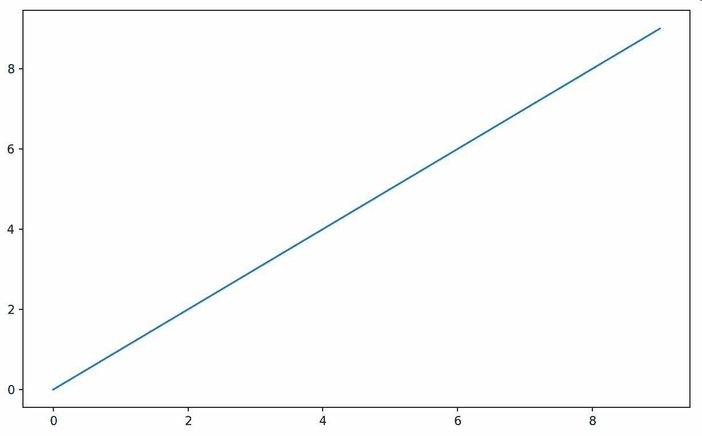

虽然 seaborn 这样的库和 pandas 的内置绘图函数能够处理许多普通的绘图任务，但如果需要自定义一些高级功能的话就必须学习 matplotlib API。

> 笔记：虽然本书没有详细地讨论 matplotlib 的各种功能，但足以将你引入门。matplotlib 的示例库和文档是学习高级特性的最好资源。

## Figure 和 Subplot

matplotlib 的图像都位于 Figure 对象中。你可以用 plt.figure 创建一个新的 Figure：

```python
In [16]: fig = plt.figure()
```

如果用的是 IPython，这时会弹出一个空窗口，但在 Jupyter 中，必须再输入更多命令才能看到。plt.figure 有一些选项，特别是 figsize，它用于确保当图片保存到磁盘时具有一定的大小和纵横比。

不能通过空 Figure 绘图。必须用 add_subplot 创建一个或多个 subplot 才行：

```python
In [17]: ax1 = fig.add_subplot(2, 2, 1)
```

这条代码的意思是：图像应该是 2×2 的（即最多 4 张图），且当前选中的是 4 个 subplot 中的第一个（编号从 1 开始）。如果再把后面两个 subplot 也创建出来，最终得到的图像如图 9-2 所示：

```python
In [18]: ax2 = fig.add_subplot(2, 2, 2)

In [19]: ax3 = fig.add_subplot(2, 2, 3)
```

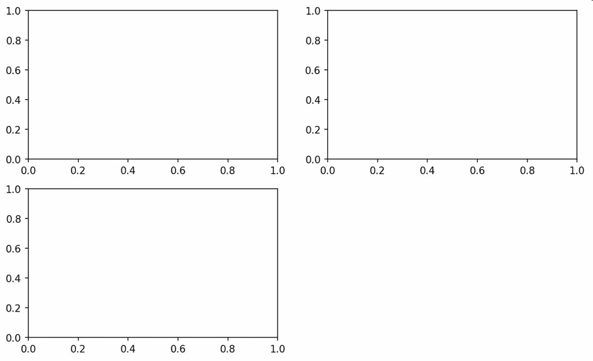

>提示：使用 Jupyter 笔记本有一点不同，即每个小窗重新执行后，图形会被重置。因此，对于复杂的图形，，你必须将所有的绘图命令存在一个小窗里。

这里，我们运行同一个小窗里的所有命令：

```python 
fig = plt.figure()
ax1 = fig.add_subplot(2, 2, 1)
ax2 = fig.add_subplot(2, 2, 2)
ax3 = fig.add_subplot(2, 2, 3)
```

如果这时执行一条绘图命令（如 plt.plot([1.5, 3.5, -2, 1.6])），matplotlib 就会在最后一个用过的 subplot（如果没有则创建一个）上进行绘制，隐藏创建 figure 和 subplot 的过程。因此，如果我们执行下列命令，你就会得到如图 9-3 所示的结果：

```python
In [20]: plt.plot(np.random.randn(50).cumsum(), 'k--')
```

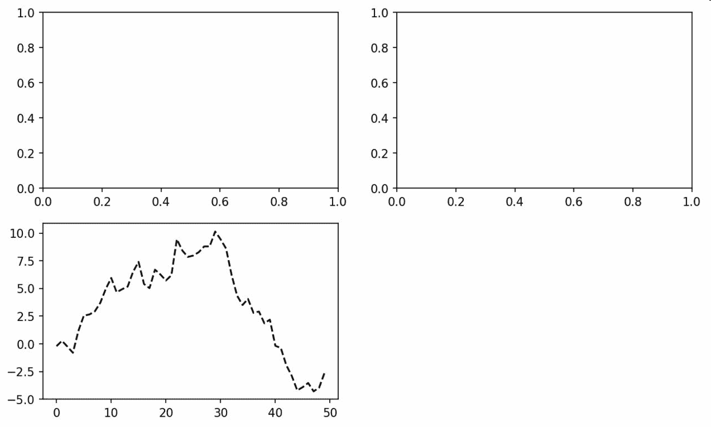

"k--"是一个线型选项，用于告诉 matplotlib 绘制黑色虚线图。上面那些由 fig.add_subplot 所返回的对象是 AxesSubplot 对象，直接调用它们的实例方法就可以在其它空着的格子里面画图了，如图 9-4 所示：

```python
In [21]: ax1.hist(np.random.randn(100), bins=20, color='k', alpha=0.3)

In [22]: ax2.scatter(np.arange(30), np.arange(30) + 3 * np.random.randn(30))
```

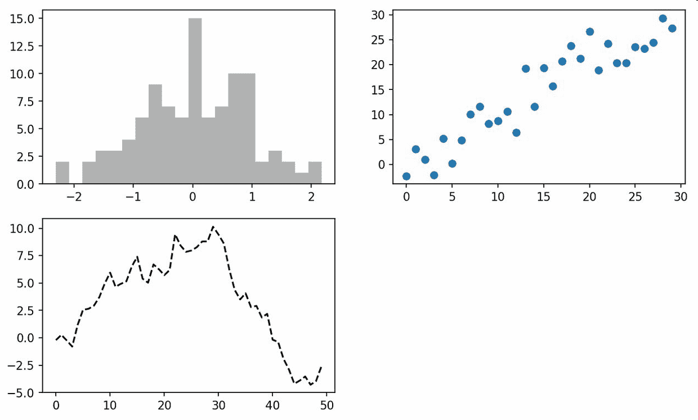

你可以在 matplotlib 的文档中找到各种图表类型。

创建包含 subplot 网格的 figure 是一个非常常见的任务，matplotlib 有一个更为方便的方法 plt.subplots，它可以创建一个新的 Figure，并返回一个含有已创建的 subplot 对象的 NumPy 数组：

```python
In [24]: fig, axes = plt.subplots(2, 3)

In [25]: axes
Out[25]: 
array([[<matplotlib.axes._subplots.AxesSubplot object at 0x7fb626374048>,
        <matplotlib.axes._subplots.AxesSubplot object at 0x7fb62625db00>,
        <matplotlib.axes._subplots.AxesSubplot object at 0x7fb6262f6c88>],
       [<matplotlib.axes._subplots.AxesSubplot object at 0x7fb6261a36a0>,
        <matplotlib.axes._subplots.AxesSubplot object at 0x7fb626181860>,
        <matplotlib.axes._subplots.AxesSubplot object at 0x7fb6260fd4e0>]], dtype
=object)
```

这是非常实用的，因为可以轻松地对 axes 数组进行索引，就好像是一个二维数组一样，例如 axes[0,1]。你还可以通过 sharex 和 sharey 指定 subplot 应该具有相同的 X 轴或 Y 轴。在比较相同范围的数据时，这也是非常实用的，否则，matplotlib 会自动缩放各图表的界限。有关该方法的更多信息，请参见表 9-1。


## 调整 subplot 周围的间距

默认情况下，matplotlib 会在 subplot 外围留下一定的边距，并在 subplot 之间留下一定的间距。间距跟图像的高度和宽度有关，因此，如果你调整了图像大小（不管是编程还是手工），间距也会自动调整。利用 Figure 的 subplots_adjust 方法可以轻而易举地修改间距，此外，它也是个顶级函数：

```python
subplots_adjust(left=None, bottom=None, right=None, top=None,
                wspace=None, hspace=None)
```

wspace 和 hspace 用于控制宽度和高度的百分比，可以用作 subplot 之间的间距。下面是一个简单的例子，其中我将间距收缩到了 0（如图 9-5 所示）：

```python
fig, axes = plt.subplots(2, 2, sharex=True, sharey=True)
for i in range(2):
    for j in range(2):
        axes[i, j].hist(np.random.randn(500), bins=50, color='k', alpha=0.5)
plt.subplots_adjust(wspace=0, hspace=0)
```

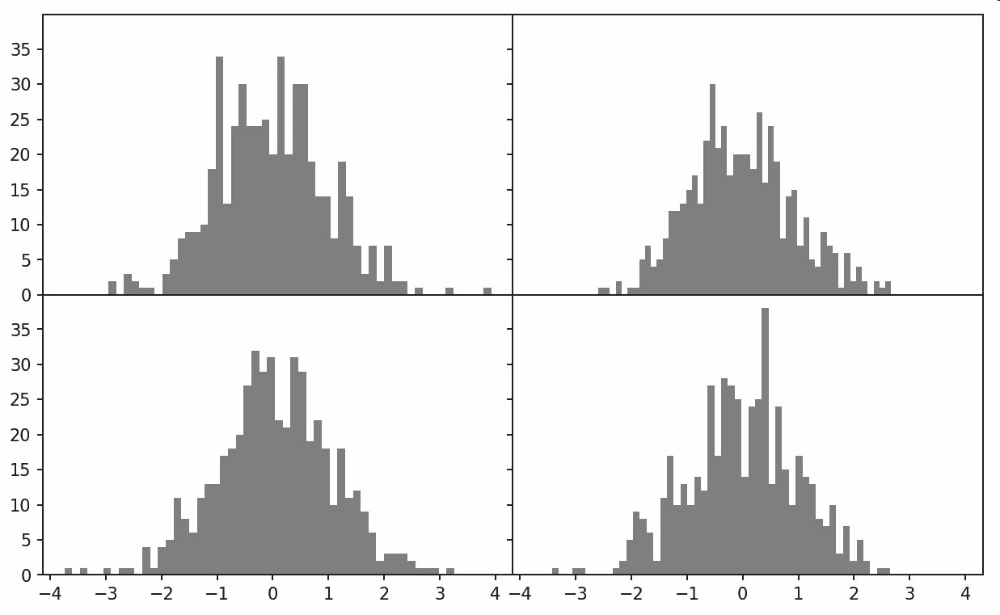

不难看出，其中的轴标签重叠了。matplotlib 不会检查标签是否重叠，所以对于这种情况，你只能自己设定刻度位置和刻度标签。后面几节将会详细介绍该内容。

## 颜色、标记和线型

matplotlib 的 plot 函数接受一组 X 和 Y 坐标，还可以接受一个表示颜色和线型的字符串缩写。例如，要根据 x 和 y 绘制绿色虚线，你可以执行如下代码：

```python
ax.plot(x, y, 'g--')
```

这种在一个字符串中指定颜色和线型的方式非常方便。在实际中，如果你是用代码绘图，你可能不想通过处理字符串来获得想要的格式。通过下面这种更为明确的方式也能得到同样的效果：

```python
ax.plot(x, y, linestyle='--', color='g')
```

常用的颜色可以使用颜色缩写，你也可以指定颜色码（例如，'#CECECE'）。你可以通过查看 plot 的文档字符串查看所有线型的合集（在 IPython 和 Jupyter 中使用 plot?）。

线图可以使用标记强调数据点。因为 matplotlib 可以创建连续线图，在点之间进行插值，因此有时可能不太容易看出真实数据点的位置。标记也可以放到格式字符串中，但标记类型和线型必须放在颜色后面（见图 9-6）：

```python
In [30]: from numpy.random import randn

In [31]: plt.plot(randn(30).cumsum(), 'ko--')
```

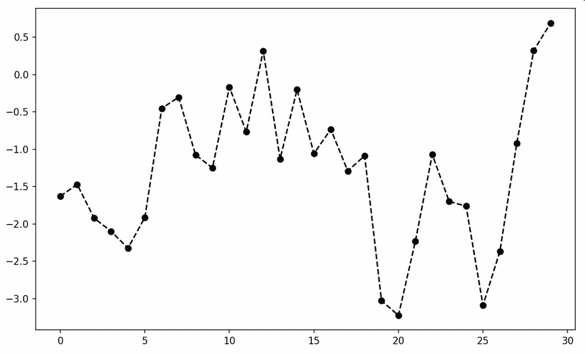

还可以将其写成更为明确的形式：

```python
plot(randn(30).cumsum(), color='k', linestyle='dashed', marker='o')
```

在线型图中，非实际数据点默认是按线性方式插值的。可以通过 drawstyle 选项修改（见图 9-7）：

```python
In [33]: data = np.random.randn(30).cumsum()

In [34]: plt.plot(data, 'k--', label='Default')
Out[34]: [<matplotlib.lines.Line2D at 0x7fb624d86160>]

In [35]: plt.plot(data, 'k-', drawstyle='steps-post', label='steps-post')
Out[35]: [<matplotlib.lines.Line2D at 0x7fb624d869e8>]

In [36]: plt.legend(loc='best')
```

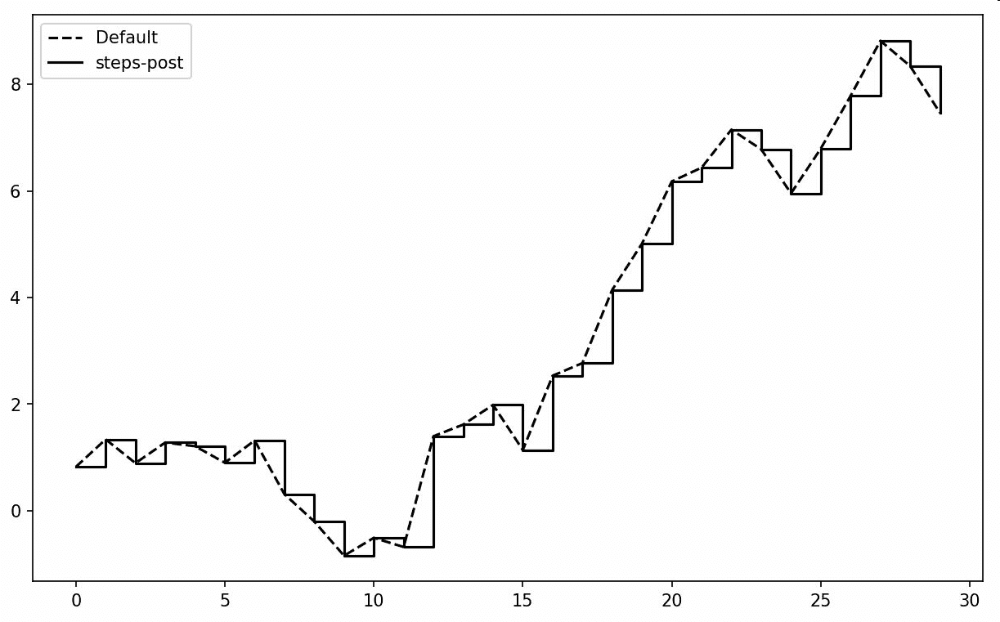

你可能注意到运行上面代码时有输出<matplotlib.lines.Line2D at ...>。matplotlib 会返回引用了新添加的子组件的对象。大多数时候，你可以放心地忽略这些输出。这里，因为我们传递了 label 参数到 plot，我们可以创建一个 plot 图例，指明每条使用 plt.legend 的线。

> 笔记：你必须调用 plt.legend（或使用 ax.legend，如果引用了轴的话）来创建图例，无论你绘图时是否传递 label 标签选项。

## 刻度、标签和图例

对于大多数的图表装饰项，其主要实现方式有二：使用过程型的 pyplot 接口（例如，matplotlib.pyplot）以及更为面向对象的原生 matplotlib API。

pyplot 接口的设计目的就是交互式使用，含有诸如 xlim、xticks 和 xticklabels 之类的方法。它们分别控制图表的范围、刻度位置、刻度标签等。其使用方式有以下两种：

- 调用时不带参数，则返回当前的参数值（例如，plt.xlim()返回当前的 X 轴绘图范围）。
- 调用时带参数，则设置参数值（例如，plt.xlim([0,10])会将 X 轴的范围设置为 0 到 10）。

所有这些方法都是对当前或最近创建的 AxesSubplot 起作用的。它们各自对应 subplot 对象上的两个方法，以 xlim 为例，就是 ax.get_xlim 和 ax.set_xlim。我更喜欢使用 subplot 的实例方法（因为我喜欢明确的事情，而且在处理多个 subplot 时这样也更清楚一些）。当然你完全可以选择自己觉得方便的那个。

## 设置标题、轴标签、刻度以及刻度标签

为了说明自定义轴，我将创建一个简单的图像并绘制一段随机漫步（如图 9-8 所示）：

```python
In [37]: fig = plt.figure()

In [38]: ax = fig.add_subplot(1, 1, 1)

In [39]: ax.plot(np.random.randn(1000).cumsum())
```

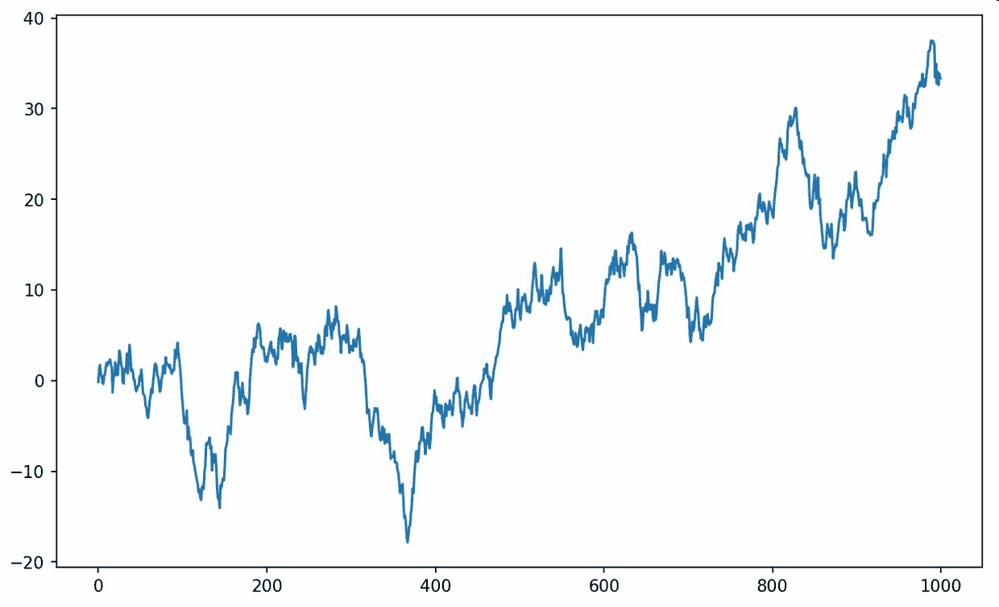

要改变 x 轴刻度，最简单的办法是使用 set_xticks 和 set_xticklabels。前者告诉 matplotlib 要将刻度放在数据范围中的哪些位置，默认情况下，这些位置也就是刻度标签。但我们可以通过 set_xticklabels 将任何其他的值用作标签：

```python
In [40]: ticks = ax.set_xticks([0, 250, 500, 750, 1000])

In [41]: labels = ax.set_xticklabels(['one', 'two', 'three', 'four', 'five'],
   ....:                             rotation=30, fontsize='small')
```

rotation 选项设定 x 刻度标签倾斜 30 度。最后，再用 set_xlabel 为 X 轴设置一个名称，并用 set_title 设置一个标题（见图 9-9 的结果）：

```python
In [42]: ax.set_title('My first matplotlib plot')
Out[42]: <matplotlib.text.Text at 0x7fb624d055f8>

In [43]: ax.set_xlabel('Stages')
```

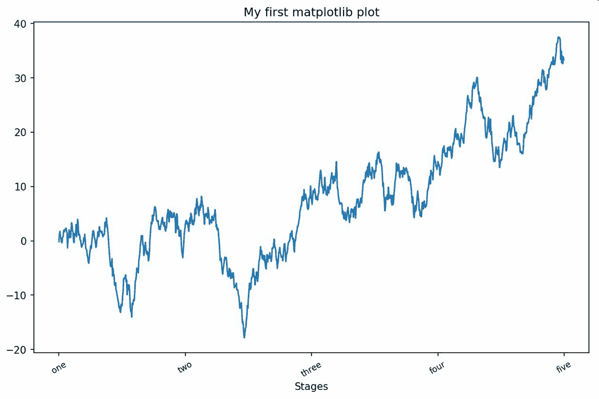

Y 轴的修改方式与此类似，只需将上述代码中的 x 替换为 y 即可。轴的类有集合方法，可以批量设定绘图选项。前面的例子，也可以写为：

```python
props = {
    'title': 'My first matplotlib plot',
    'xlabel': 'Stages'
}
ax.set(**props)
```

## 添加图例

图例（legend）是另一种用于标识图表元素的重要工具。添加图例的方式有多种。最简单的是在添加 subplot 的时候传入 label 参数：

```python
In [44]: from numpy.random import randn

In [45]: fig = plt.figure(); ax = fig.add_subplot(1, 1, 1)

In [46]: ax.plot(randn(1000).cumsum(), 'k', label='one')
Out[46]: [<matplotlib.lines.Line2D at 0x7fb624bdf860>]

In [47]: ax.plot(randn(1000).cumsum(), 'k--', label='two')
Out[47]: [<matplotlib.lines.Line2D at 0x7fb624be90f0>]

In [48]: ax.plot(randn(1000).cumsum(), 'k.', label='three')
Out[48]: [<matplotlib.lines.Line2D at 0x7fb624be9160>]
```

在此之后，你可以调用 ax.legend()或 plt.legend()来自动创建图例（结果见图 9-10）：

```python
In [49]: ax.legend(loc='best')
```

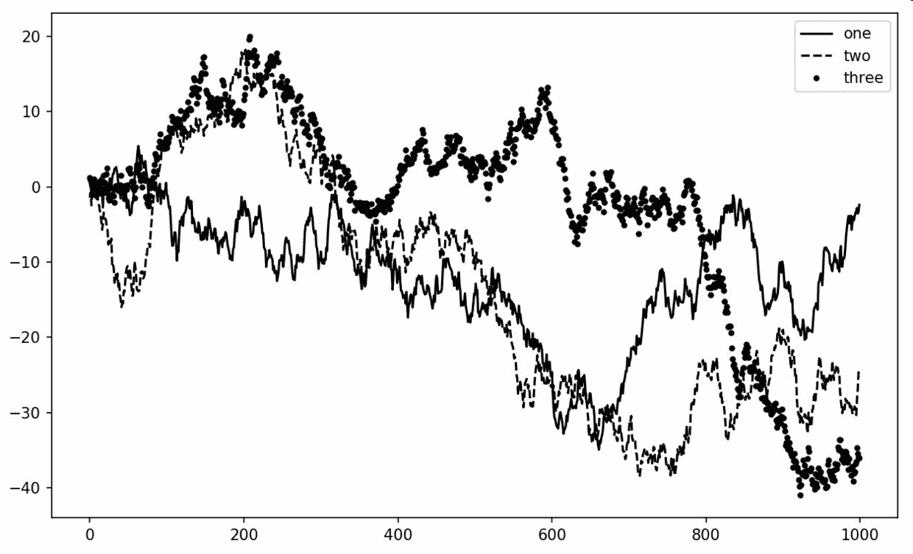

legend 方法有几个其它的 loc 位置参数选项。请查看文档字符串（使用 ax.legend?）。

loc 告诉 matplotlib 要将图例放在哪。如果你不是吹毛求疵的话，"best"是不错的选择，因为它会选择最不碍事的位置。要从图例中去除一个或多个元素，不传入 label 或传入 label='_nolegend_'即可。（中文第一版这里把 best 错写成了 beat）

## 注解以及在 Subplot 上绘图

除标准的绘图类型，你可能还希望绘制一些子集的注解，可能是文本、箭头或其他图形等。注解和文字可以通过 text、arrow 和 annotate 函数进行添加。text 可以将文本绘制在图表的指定坐标(x,y)，还可以加上一些自定义格式：

```python
ax.text(x, y, 'Hello world!',
        family='monospace', fontsize=10)
```

注解中可以既含有文本也含有箭头。例如，我们根据最近的标准普尔 500 指数价格（来自 Yahoo!Finance）绘制一张曲线图，并标出 2008 年到 2009 年金融危机期间的一些重要日期。你可以在 Jupyter 笔记本的一个小窗中试验这段代码（图 9-11 是结果）：

```python
from datetime import datetime

fig = plt.figure()
ax = fig.add_subplot(1, 1, 1)

data = pd.read_csv('examples/spx.csv', index_col=0, parse_dates=True)
spx = data['SPX']

spx.plot(ax=ax, style='k-')

crisis_data = [
    (datetime(2007, 10, 11), 'Peak of bull market'),
    (datetime(2008, 3, 12), 'Bear Stearns Fails'),
    (datetime(2008, 9, 15), 'Lehman Bankruptcy')
]

for date, label in crisis_data:
    ax.annotate(label, xy=(date, spx.asof(date) + 75),
                xytext=(date, spx.asof(date) + 225),
                arrowprops=dict(facecolor='black', headwidth=4, width=2,
                                headlength=4),
                horizontalalignment='left', verticalalignment='top')

# Zoom in on 2007-2010
ax.set_xlim(['1/1/2007', '1/1/2011'])
ax.set_ylim([600, 1800])

ax.set_title('Important dates in the 2008-2009 financial crisis')
```

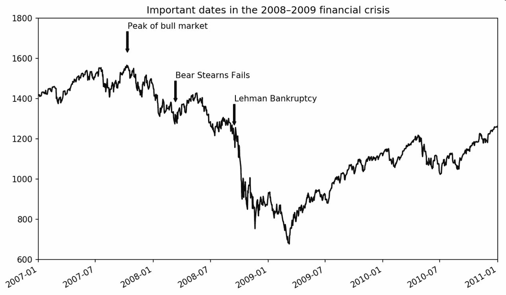

这张图中有几个重要的点要强调：ax.annotate 方法可以在指定的 x 和 y 坐标轴绘制标签。我们使用 set_xlim 和 set_ylim 人工设定起始和结束边界，而不使用 matplotlib 的默认方法。最后，用 ax.set_title 添加图标标题。

更多有关注解的示例，请访问 matplotlib 的在线示例库。

图形的绘制要麻烦一些。matplotlib 有一些表示常见图形的对象。这些对象被称为块（patch）。其中有些（如 Rectangle 和 Circle），可以在 matplotlib.pyplot 中找到，但完整集合位于 matplotlib.patches。

要在图表中添加一个图形，你需要创建一个块对象 shp，然后通过 ax.add_patch(shp)将其添加到 subplot 中（如图 9-12 所示）：

```python
fig = plt.figure()
ax = fig.add_subplot(1, 1, 1)

rect = plt.Rectangle((0.2, 0.75), 0.4, 0.15, color='k', alpha=0.3)
circ = plt.Circle((0.7, 0.2), 0.15, color='b', alpha=0.3)
pgon = plt.Polygon([[0.15, 0.15], [0.35, 0.4], [0.2, 0.6]],
                   color='g', alpha=0.5)

ax.add_patch(rect)
ax.add_patch(circ)
ax.add_patch(pgon)
```

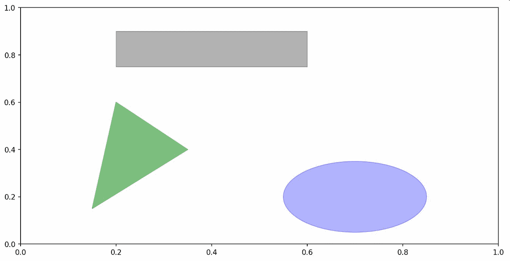


如果查看许多常见图表对象的具体实现代码，你就会发现它们其实就是由块 patch 组装而成的。

## 将图表保存到文件

利用 plt.savefig 可以将当前图表保存到文件。该方法相当于 Figure 对象的实例方法 savefig。例如，要将图表保存为 SVG 文件，你只需输入：

```python
plt.savefig('figpath.svg')
```

文件类型是通过文件扩展名推断出来的。因此，如果你使用的是.pdf，就会得到一个 PDF 文件。我在发布图片时最常用到两个重要的选项是 dpi（控制“每英寸点数”分辨率）和 bbox_inches（可以剪除当前图表周围的空白部分）。要得到一张带有最小白边且分辨率为 400DPI 的 PNG 图片，你可以：

```python
plt.savefig('figpath.png', dpi=400, bbox_inches='tight')
```

savefig 并非一定要写入磁盘，也可以写入任何文件型的对象，比如 BytesIO：

```python
from io import BytesIO
buffer = BytesIO()
plt.savefig(buffer)
plot_data = buffer.getvalue()
```

表 9-2 列出了 savefig 的其它选项。

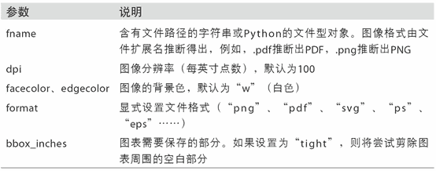

## matplotlib 配置

matplotlib 自带一些配色方案，以及为生成出版质量的图片而设定的默认配置信息。幸运的是，几乎所有默认行为都能通过一组全局参数进行自定义，它们可以管理图像大小、subplot 边距、配色方案、字体大小、网格类型等。一种 Python 编程方式配置系统的方法是使用 rc 方法。例如，要将全局的图像默认大小设置为 10×10，你可以执行：

```python
plt.rc('figure', figsize=(10, 10))
```

rc 的第一个参数是希望自定义的对象，如'figure'、'axes'、'xtick'、'ytick'、'grid'、'legend'等。其后可以跟上一系列的关键字参数。一个简单的办法是将这些选项写成一个字典：

```python
font_options = {'family' : 'monospace',
                'weight' : 'bold',
                'size'   : 'small'}
plt.rc('font', **font_options)
```

要了解全部的自定义选项，请查阅 matplotlib 的配置文件 matplotlibrc（位于 matplotlib/mpl-data 目录中）。如果对该文件进行了自定义，并将其放在你自己的.matplotlibrc 目录中，则每次使用 matplotlib 时就会加载该文件。

下一节，我们会看到，seaborn 包有若干内置的绘图主题或类型，它们使用了 matplotlib 的内部配置。

# 9.2 使用 pandas 和 seaborn 绘图

matplotlib 实际上是一种比较低级的工具。要绘制一张图表，你组装一些基本组件就行：数据展示（即图表类型：线型图、柱状图、盒形图、散布图、等值线图等）、图例、标题、刻度标签以及其他注解型信息。

在 pandas 中，我们有多列数据，还有行和列标签。pandas 自身就有内置的方法，用于简化从`DataFrame`和`Series`绘制图形。另一个库 seaborn（https://seaborn.pydata.org/），由 Michael Waskom 创建的静态图形库。Seaborn 简化了许多常见可视类型的创建。

>提示：引入 seaborn 会修改 matplotlib 默认的颜色方案和绘图类型，以提高可读性和美观度。即使你不使用 seaborn API，你可能也会引入 seaborn，作为提高美观度和绘制常见 matplotlib 图形的简化方法。

## 线型图

`Series`和`DataFrame`都有一个用于生成各类图表的 plot 方法。默认情况下，它们所生成的是线型图（如图 9-13 所示）：

```python
In [60]: s = pd.Series(np.random.randn(10).cumsum(), index=np.arange(0, 100, 10))

In [61]: s.plot()
```


该`Series`对象的索引会被传给 matplotlib，并用以绘制 X 轴。可以通过 use_index=False 禁用该功能。X 轴的刻度和界限可以通过 xticks 和 xlim 选项进行调节，Y 轴就用 yticks 和 ylim。plot 参数的完整列表请参见表 9-3。我只会讲解其中几个，剩下的就留给读者自己去研究了。


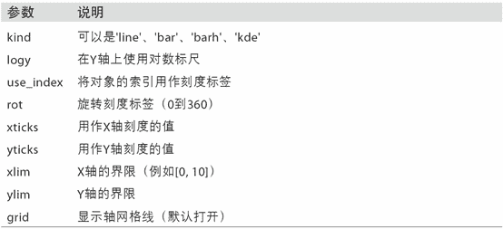

pandas 的大部分绘图方法都有一个可选的 ax 参数，它可以是一个 matplotlib 的 subplot 对象。这使你能够在网格布局中更为灵活地处理 subplot 的位置。

`DataFrame`的 plot 方法会在一个 subplot 中为各列绘制一条线，并自动创建图例（如图 9-14 所示）：
```python
In [62]: df = pd.DataFrame(np.random.randn(10, 4).cumsum(0),
   ....:                   columns=['A', 'B', 'C', 'D'],
   ....:                   index=np.arange(0, 100, 10))

In [63]: df.plot()
```


plot 属性包含一批不同绘图类型的方法。例如，df.plot()等价于 df.plot.line()。后面会学习这些方法。

> 笔记：plot 的其他关键字参数会被传给相应的 matplotlib 绘图函数，所以要更深入地自定义图表，就必须学习更多有关 matplotlib API 的知识。

`DataFrame`还有一些用于对列进行灵活处理的选项，例如，是要将所有列都绘制到一个 subplot 中还是创建各自的 subplot。详细信息请参见表 9-4。


>注意： 有关时间序列的绘图，请见第 11 章。

## 柱状图

plot.bar()和 plot.barh()分别绘制水平和垂直的柱状图。这时，`Series`和`DataFrame`的索引将会被用作 X（bar）或 Y（barh）刻度（如图 9-15 所示）：

```python
In [64]: fig, axes = plt.subplots(2, 1)

In [65]: data = pd.Series(np.random.rand(16), index=list('abcdefghijklmnop'))

In [66]: data.plot.bar(ax=axes[0], color='k', alpha=0.7)
Out[66]: <matplotlib.axes._subplots.AxesSubplot at 0x7fb62493d470>

In [67]: data.plot.barh(ax=axes[1], color='k', alpha=0.7)
```

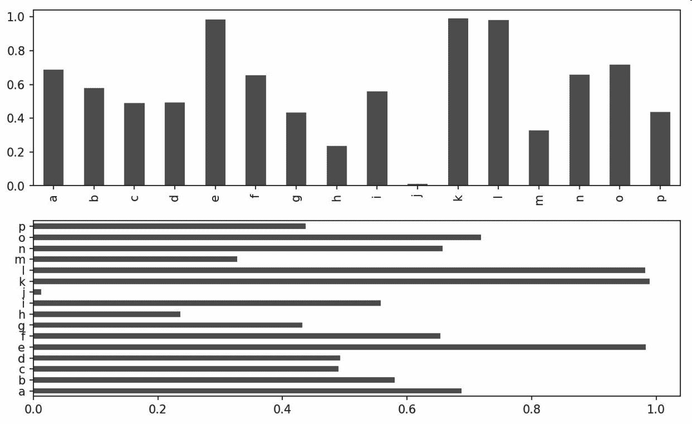

color='k'和 alpha=0.7 设定了图形的颜色为黑色，并使用部分的填充透明度。对于`DataFrame`，柱状图会将每一行的值分为一组，并排显示，如图 9-16 所示：

```python
In [69]: df = pd.DataFrame(np.random.rand(6, 4),
   ....:                   index=['one', 'two', 'three', 'four', 'five', 'six'],
   ....:                   columns=pd.Index(['A', 'B', 'C', 'D'], name='Genus'))

In [70]: df
Out[70]: 
Genus         A         B         C         D
one    0.370670  0.602792  0.229159  0.486744
two    0.420082  0.571653  0.049024  0.880592
three  0.814568  0.277160  0.880316  0.431326
four   0.374020  0.899420  0.460304  0.100843
five   0.433270  0.125107  0.494675  0.961825
six    0.601648  0.478576  0.205690  0.560547

In [71]: df.plot.bar()
```


注意，`DataFrame`各列的名称"Genus"被用作了图例的标题。

设置 stacked=True 即可为`DataFrame`生成堆积柱状图，这样每行的值就会被堆积在一起（如图 9-17 所示）：

```python
In [73]: df.plot.barh(stacked=True, alpha=0.5)
```


> 笔记：柱状图有一个非常不错的用法：利用 value_counts 图形化显示`Series`中各值的出现频率，比如 s.value_counts().plot.bar()。

再以本书前面用过的那个有关小费的数据集为例，假设我们想要做一张堆积柱状图以展示每天各种聚会规模的数据点的百分比。我用 read_csv 将数据加载进来，然后根据日期和聚会规模创建一张交叉表：

```python
In [75]: tips = pd.read_csv('examples/tips.csv')

In [76]: party_counts = pd.crosstab(tips['day'], tips['size'])

In [77]: party_counts
Out[77]: 
size  1   2   3   4  5  6
day                      
Fri   1  16   1   1  0  0
Sat   2  53  18  13  1  0
Sun   0  39  15  18  3  1
Thur  1  48   4   5  1  3

# Not many 1- and 6-person parties
In [78]: party_counts = party_counts.loc[:, 2:5]
```

然后进行规格化，使得各行的和为 1，并生成图表（如图 9-18 所示）：

```python
# Normalize to sum to 1
In [79]: party_pcts = party_counts.div(party_counts.sum(1), axis=0)

In [80]: party_pcts
Out[80]: 
size         2         3         4         5
day                                         
Fri   0.888889  0.055556  0.055556  0.000000
Sat   0.623529  0.211765  0.152941  0.011765
Sun   0.520000  0.200000  0.240000  0.040000
Thur  0.827586  0.068966  0.086207  0.017241

In [81]: party_pcts.plot.bar()
```

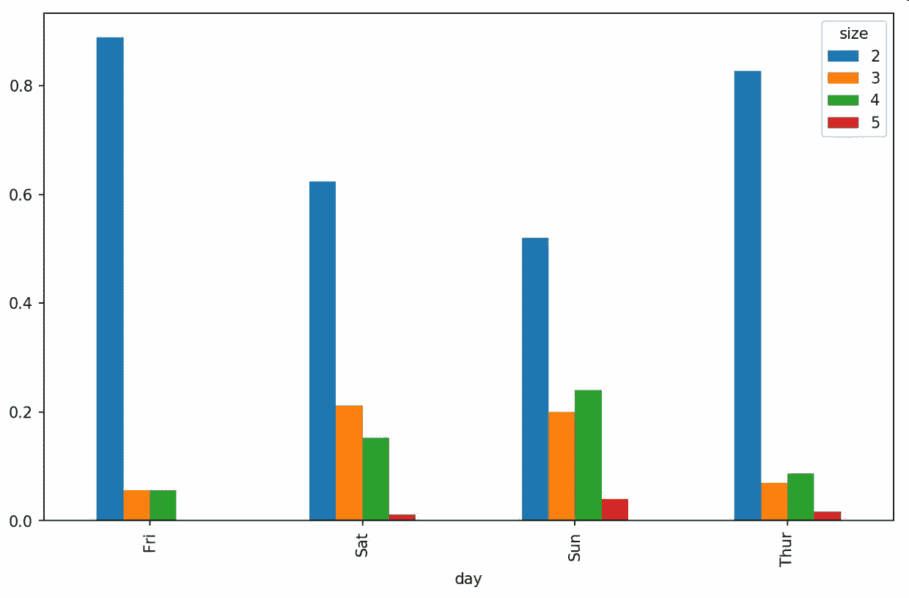

于是，通过该数据集就可以看出，聚会规模在周末会变大。

对于在绘制一个图形之前，需要进行合计的数据，使用 seaborn 可以减少工作量。用 seaborn 来看每天的小费比例（图 9-19 是结果）：

```python
In [83]: import seaborn as sns

In [84]: tips['tip_pct'] = tips['tip'] / (tips['total_bill'] - tips['tip'])

In [85]: tips.head()
Out[85]: 
   total_bill   tip smoker  day    time  size   tip_pct
0       16.99  1.01     No  Sun  Dinner     2  0.063204
1       10.34  1.66     No  Sun  Dinner     3  0.191244
2       21.01  3.50     No  Sun  Dinner     3  0.199886
3       23.68  3.31     No  Sun  Dinner     2  0.162494
4       24.59  3.61     No  Sun  Dinner     4  0.172069

In [86]: sns.barplot(x='tip_pct', y='day', data=tips, orient='h')
```

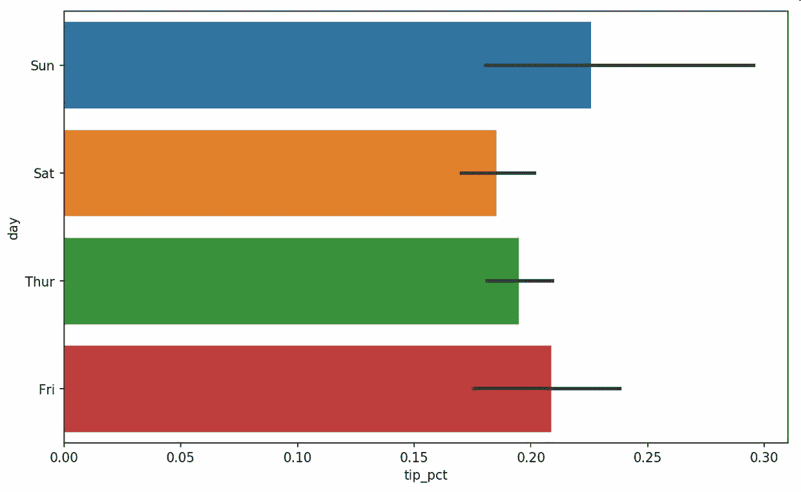

seaborn 的绘制函数使用 data 参数，它可能是 pandas 的`DataFrame`。其它的参数是关于列的名字。因为一天的每个值有多次观察，柱状图的值是 tip_pct 的平均值。绘制在柱状图上的黑线代表 95%置信区间（可以通过可选参数配置）。

seaborn.barplot 有颜色选项，使我们能够通过一个额外的值设置（见图 9-20）：

```python
In [88]: sns.barplot(x='tip_pct', y='day', hue='time', data=tips, orient='h')
```

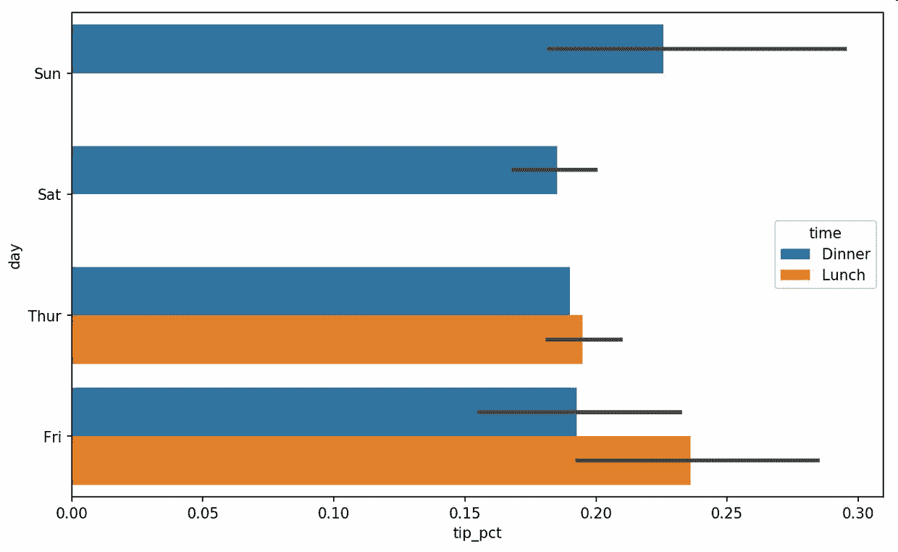

注意，seaborn 已经自动修改了图形的美观度：默认调色板，图形背景和网格线的颜色。你可以用 seaborn.set 在不同的图形外观之间切换：

```python
In [90]: sns.set(style="whitegrid")
```

## 直方图和密度图

直方图（histogram）是一种可以对值频率进行离散化显示的柱状图。数据点被拆分到离散的、间隔均匀的面元中，绘制的是各面元中数据点的数量。再以前面那个小费数据为例，通过在`Series`使用 plot.hist 方法，我们可以生成一张“小费占消费总额百分比”的直方图（如图 9-21 所示）：
```python
In [92]: tips['tip_pct'].plot.hist(bins=50)
```

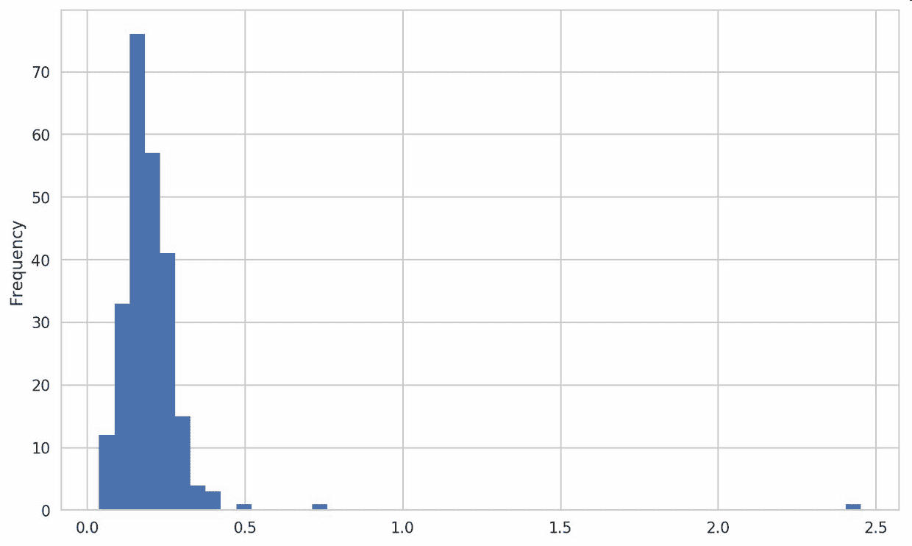

与此相关的一种图表类型是密度图，它是通过计算“可能会产生观测数据的连续概率分布的估计”而产生的。一般的过程是将该分布近似为一组核（即诸如正态分布之类的较为简单的分布）。因此，密度图也被称作 KDE（Kernel Density Estimate，核密度估计）图。使用 plot.kde 和标准混合正态分布估计即可生成一张密度图（见图 9-22）：
```python
In [94]: tips['tip_pct'].plot.density()
```

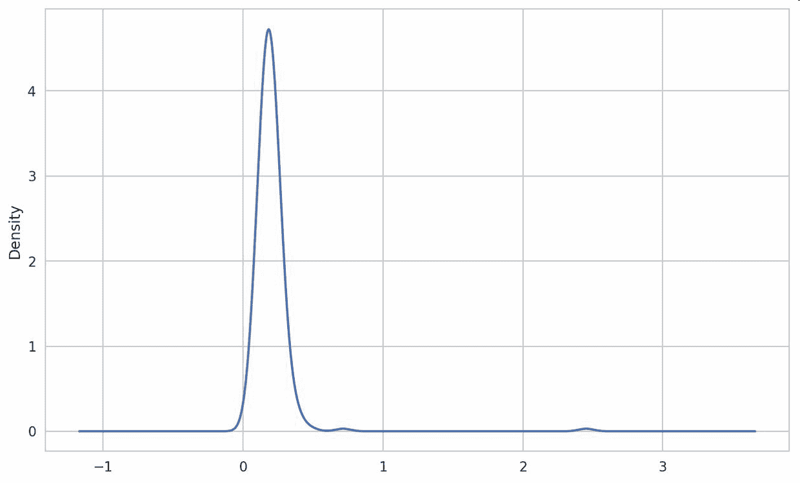

seaborn 的 distplot 方法绘制直方图和密度图更加简单，还可以同时画出直方图和连续密度估计图。作为例子，考虑一个双峰分布，由两个不同的标准正态分布组成（见图 9-23）：

```python
In [96]: comp1 = np.random.normal(0, 1, size=200)

In [97]: comp2 = np.random.normal(10, 2, size=200)

In [98]: values = pd.Series(np.concatenate([comp1, comp2]))

In [99]: sns.distplot(values, bins=100, color='k')
```


## 散布图或点图

点图或散布图是观察两个一维数据序列之间的关系的有效手段。在下面这个例子中，我加载了来自 statsmodels 项目的 macrodata 数据集，选择了几个变量，然后计算对数差：

```python
In [100]: macro = pd.read_csv('examples/macrodata.csv')

In [101]: data = macro[['cpi', 'm1', 'tbilrate', 'unemp']]

In [102]: trans_data = np.log(data).diff().dropna()

In [103]: trans_data[-5:]
Out[103]: 
          cpi        m1  tbilrate     unemp
198 -0.007904  0.045361 -0.396881  0.105361
199 -0.021979  0.066753 -2.277267  0.139762
200  0.002340  0.010286  0.606136  0.160343
201  0.008419  0.037461 -0.200671  0.127339
202  0.008894  0.012202 -0.405465  0.042560
```

然后可以使用 seaborn 的 regplot 方法，它可以做一个散布图，并加上一条线性回归的线（见图 9-24）：

```python
In [105]: sns.regplot('m1', 'unemp', data=trans_data)
Out[105]: <matplotlib.axes._subplots.AxesSubplot at 0x7fb613720be0>

In [106]: plt.title('Changes in log %s versus log %s' % ('m1', 'unemp'))
```


在探索式数据分析工作中，同时观察一组变量的散布图是很有意义的，这也被称为散布图矩阵（scatter plot matrix）。纯手工创建这样的图表很费工夫，所以 seaborn 提供了一个便捷的 pairplot 函数，它支持在对角线上放置每个变量的直方图或密度估计（见图 9-25）：

```python
In [107]: sns.pairplot(trans_data, diag_kind='kde', plot_kws={'alpha': 0.2})
```


你可能注意到了 plot_kws 参数。它可以让我们传递配置选项到非对角线元素上的图形使用。对于更详细的配置选项，可以查阅 seaborn.pairplot 文档字符串。


##分面网格（facet grid）和类型数据
要是数据集有额外的分组维度呢？有多个分类变量的数据可视化的一种方法是使用小面网格。seaborn 有一个有用的内置函数 factorplot，可以简化制作多种分面图（见图 9-26）：
```python
 In [108]: sns.factorplot(x='day', y='tip_pct', hue='time', col='smoker',
   .....:                kind='bar', data=tips[tips.tip_pct < 1])
```

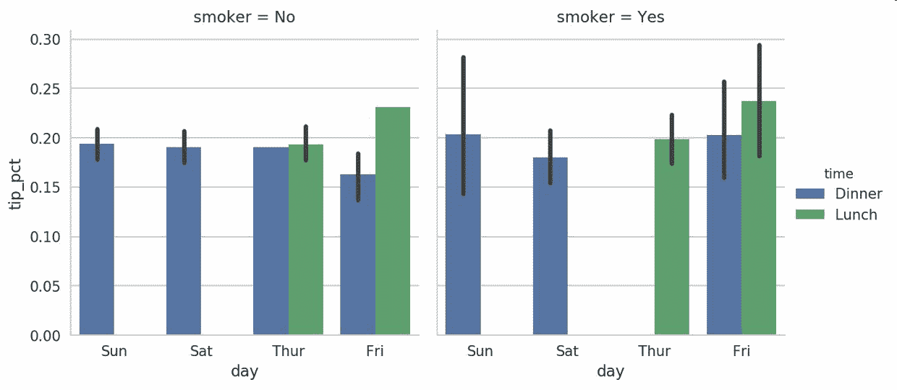

除了在分面中用不同的颜色按时间分组，我们还可以通过给每个时间值添加一行来扩展分面网格：

```python
In [109]: sns.factorplot(x='day', y='tip_pct', row='time',
   .....:                col='smoker',
   .....:                kind='bar', data=tips[tips.tip_pct < 1])
```

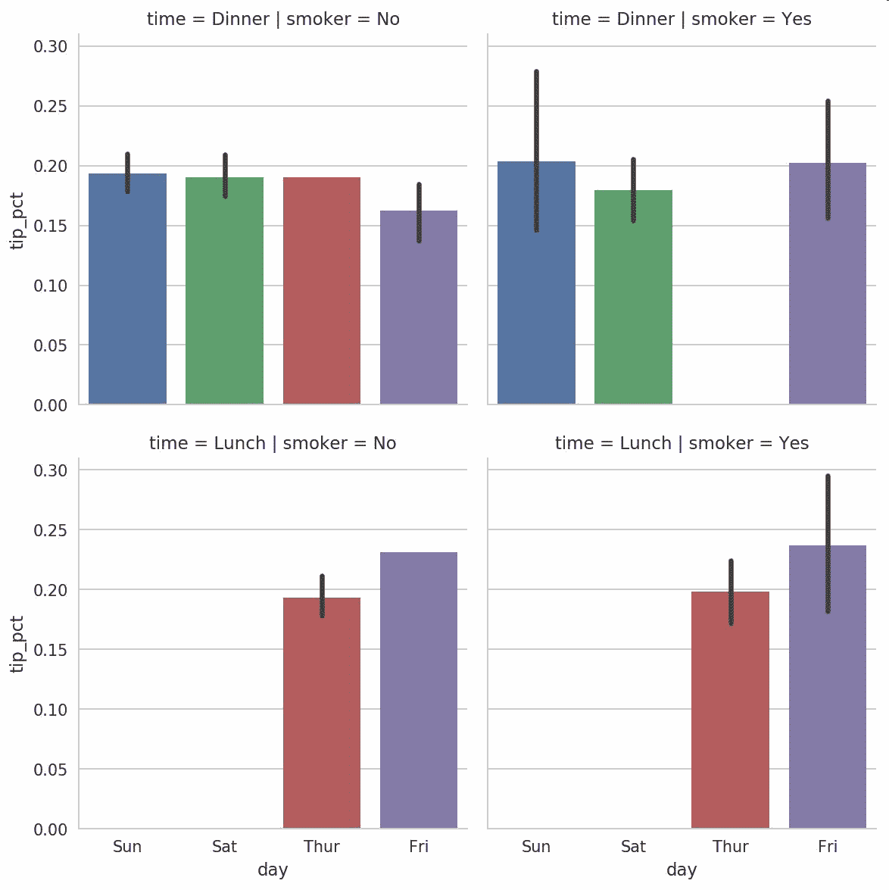

factorplot 支持其它的绘图类型，你可能会用到。例如，盒图（它可以显示中位数，四分位数，和异常值）就是一个有用的可视化类型（见图 9-28）：

```python
In [110]: sns.factorplot(x='tip_pct', y='day', kind='box',
   .....:                data=tips[tips.tip_pct < 0.5])
```

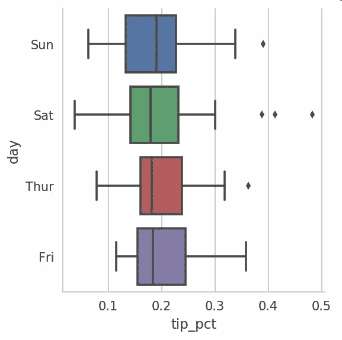

使用更通用的 seaborn.FacetGrid 类，你可以创建自己的分面网格。请查阅 seaborn 的文档（https://seaborn.pydata.org/）。

# 9.3 其它的 Python 可视化工具
与其它开源库类似，Python 创建图形的方式非常多（根本罗列不完）。自从 2010 年，许多开发工作都集中在创建交互式图形以便在 Web 上发布。利用工具如 Boken（https://bokeh.pydata.org/en/latest/）和 Plotly（https://github.com/plotly/plotly.py），现在可以创建动态交互图形，用于网页浏览器。

对于创建用于打印或网页的静态图形，我建议默认使用 matplotlib 和附加的库，比如 pandas 和 seaborn。对于其它数据可视化要求，学习其它的可用工具可能是有用的。我鼓励你探索绘图的生态系统，因为它将持续发展。

# 9.4 总结

本章的目的是熟悉一些基本的数据可视化操作，使用 pandas，matplotlib，和 seaborn。如果视觉显示数据分析的结果对你的工作很重要，我鼓励你寻求更多的资源来了解更高效的数据可视化。这是一个活跃的研究领域，你可以通过在线和纸质的形式学习许多优秀的资源。

下一章，我们将重点放在 pandas 的数据聚合和分组操作上。
